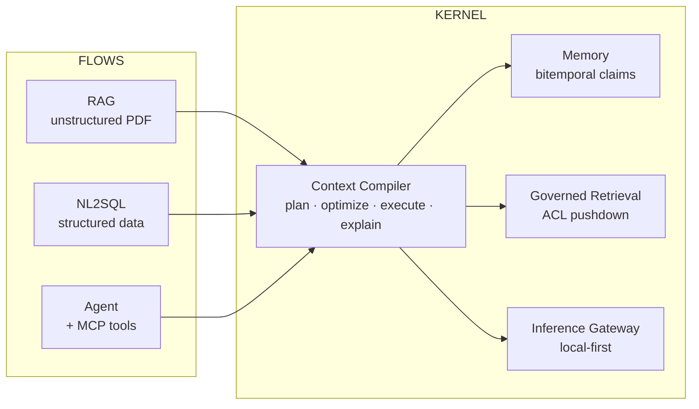

# Architecture

**Document owner:** Platform Architecture
**Status:** Baseline — approved for implementation
**Audience:** Engineers building or extending Mnemos. Assumes senior backend fluency;
assumes no prior knowledge of this codebase.

---

## 1. Problem statement

An LLM's behaviour is a function of exactly one input: the token sequence it receives.
Every other engineering concern — retrieval quality, memory, personalization, safety,
cost — is ultimately a question of *what ends up in that sequence, and why*.

Yet in practice that sequence is assembled by imperative glue code: fetch the last N
turns, embed the query, take top-k chunks, string-concatenate, truncate if it doesn't
fit. This has four consequences that get worse with scale, not better:

1. **It is not explainable.** When an agent gives a bad answer, you cannot answer
   "what was in its context and what did we leave out?" without reading code and
   replaying by hand.
2. **It is not budgeted.** Token windows are a hard, shared, contended resource, and
   nothing arbitrates between competing claimants. The last writer wins; the most
   important source silently loses.
3. **It is not governed.** Access control is applied *after* retrieval, if at all.
   Post-filtering leaks the existence of documents through result-count side channels
   and silently destroys recall.
4. **It is not reproducible.** The same request an hour later produces different
   context, so you cannot regression-test the thing that actually determines model
   behaviour.

These are not prompt-engineering problems. They are **resource management, access
control, provenance, and reproducibility** problems — which is to say, they are
operating-system problems.

## 2. Thesis

> **Context is a compiled artifact, not a concatenated string.**

Mnemos applies the architecture of a cost-based query optimizer to context assembly:

| Database concept | Mnemos analogue |
|---|---|
| SQL query | `ContextRequest` |
| Parse + bind against catalog | Intent extraction + entity binding against memory/graph |
| Logical plan (relational algebra) | Logical plan (retrieval operator algebra) |
| Rewrite rules (predicate pushdown) | Rewrite rules (ACL pushdown, branch elimination) |
| Statistics catalog (`ANALYZE`) | Per-tenant operator statistics, refreshed continuously |
| Cost-based optimizer | Budget allocator over tokens × latency × dollars |
| Physical plan | Physical plan with per-operator `k`, deadline, fallback |
| Executor | Deadline-bounded async operator DAG |
| Result set | `ContextBundle` (content-addressed + provenance manifest) |
| `EXPLAIN ANALYZE` | `EXPLAIN CONTEXT` |
| Plan cache | Bundle cache, keyed by request digest × catalog version |

The analogy is load-bearing, not decorative. It tells us what to build next at every
decision point, and it sets a quality bar that is already well understood by the
industry.

## 3. Architectural principles

These are binding. Deviations require an ADR.

| # | Principle | Consequence |
|---|---|---|
| P1 | **Dependencies point inward.** | Domain has zero I/O imports. Enforced in CI by `import-linter`, not by convention. |
| P2 | **Ports before adapters.** | Every external dependency is a `typing.Protocol` in the domain layer; adapters implement it. Swapping Neo4j or pgvector touches one package. |
| P3 | **Fail closed.** | Absence of an explicit allow is a deny. Unparseable policy, unavailable PDP, and unknown resource class all deny. |
| P4 | **Determinism where possible; pinned where not.** | Non-deterministic steps (LLM calls) are content-hash-cached and their outputs pinned into the bundle, so replay is exact. |
| P5 | **Nothing is overwritten.** | Memory updates append and supersede. Deletion is a distinct, audited, explicitly-invoked operation. |
| P6 | **Every budget is explicit and enforced.** | Tokens, latency, dollars, retries, loop iterations, concurrency. No unbounded loop touches an LLM. |
| P7 | **Configuration is data.** | Policies, weights, templates, model routes, and operator costs live in the database with admin APIs and version history — not in code. |
| P8 | **Provenance is not optional.** | Every token in an assembled context traces to a source, a score, an operator, and an authorization decision. |
| P9 | **Degrade, don't fail.** | A slow or dead retrieval source produces a degraded bundle with a recorded `DegradationEvent`, never a 500. |
| P10 | **Trust is tiered and monotone.** | Instruction authority never increases as content moves through the system. |

## 4. Layering

Feature-first at the top level, clean-architecture layers inside each feature.

```
                   ┌──────────────────────────────────────────────┐
   driving  ─────▶ │  entrypoints/   HTTP · WebSocket · Worker ·   │
   adapters        │                 CLI · MCP server              │
                   └──────────────────────┬───────────────────────┘
                                          │ depends on
                   ┌──────────────────────▼───────────────────────┐
                   │  application/   use cases, orchestration,     │
                   │                 transactions, events emitted  │
                   └──────────────────────┬───────────────────────┘
                                          │ depends on
                   ┌──────────────────────▼───────────────────────┐
                   │  domain/        entities, value objects,      │
                   │                 invariants, PORTS (Protocol)  │
                   │                 ── zero I/O imports ──        │
                   └──────────────────────▲───────────────────────┘
                                          │ implements
                   ┌──────────────────────┴───────────────────────┐
   driven   ─────▶ │  adapters/      postgres · pgvector · neo4j · │
   adapters        │                 redis · rabbitmq · litellm    │
                   └──────────────────────────────────────────────┘
```

**Why layering inside features rather than layers at the top level.** A top-level
`domain/ application/ adapters/` split forces every change to touch three distant
directories and makes feature ownership ambiguous. Feature-first keeps a change
local — the memory lifecycle policy, its repository port, its Postgres adapter, and
its HTTP router live together — while the inner layering still prevents the domain
from importing SQLAlchemy. See [ADR-0003](ArchitectureDecisionRecords/ADR-0003-feature-first-clean-architecture.md).

**Enforcement.** `import-linter` contracts in CI assert:
- `mnemos.features.*.domain` may not import `sqlalchemy`, `httpx`, `redis`, `neo4j`, `fastapi`, or any `adapters` module.
- Features may not import each other's internals — only their published `contracts` module.
- `mnemos.core` may not import any feature.

A violation fails the build. Architecture that isn't enforced by CI is documentation
of intent, not architecture.

## 5. Feature map

Mnemos is split into a **kernel** and three **flows** that consume it.

```
── KERNEL ──────────────────────────────────────────────────────────────────
mnemos.core            cross-cutting: config, errors, ids, clock, DI,
                       telemetry, pagination, result types
mnemos.platform        shared driven adapters: db session/UoW, redis, broker,
                       outbox relay, object store

mnemos.features.identity      orgs, users, workspaces, sessions, API keys, RBAC, PDP
mnemos.features.memory        claim model, bitemporal store, lifecycle engine
mnemos.features.retrieval     lexical · vector · graph · fusion · rerank operators
mnemos.features.context       ▲ THE CONTEXT COMPILER ▲ bind, plan, optimize,
                              execute, assemble, explain, replay
mnemos.features.knowledge     entity/relation extraction, graph projection, linking
mnemos.features.gateway       inference routing, caching, budgets, circuit breaking
mnemos.features.observability traces, bundle inspection, compute accounting

── FLOWS (consumers of the kernel) ─────────────────────────────────────────
mnemos.flows.rag              unstructured PDF → chunks → governed retrieval → answer
mnemos.flows.nl2sql           NL → schema context → validated SQL → results → narration
mnemos.flows.agent            durable agent runtime (plan/act/critic/verify, HITL)
mnemos.flows.tools            ▲ SEPARATE ENTITY ▲ MCP registry, remote MCP client,
                              API→MCP wrapper generation, credential isolation
```

Novelty is concentrated in `context`, `memory`, and the authorization path through
`retrieval`. `identity` and `gateway` are deliberately competent-but-conventional:
necessary for the platform to be real, not where the argument is made.

## 5.5 The three flows — why they exist

An abstraction validated by a single consumer is speculation. The kernel's claim is that
context assembly can be *planned* rather than hand-written, and that claim is only
credible if genuinely different consumers can be expressed in the same operator algebra.
The three flows are chosen precisely because they stress different parts of it:

| Flow | Retrieves from | Stresses | Would break the kernel if… |
|---|---|---|---|
| **RAG** (unstructured PDF) | chunks, memory, graph | Ranking, dedup, compression under a tight budget | …fusion across heterogeneous scorers didn't work |
| **NL2SQL** (structured) | schema metadata, glossary, exemplar queries, memory | Precision, ACL pushdown, *fail-closed* table authorization | …the planner couldn't express "must include these tables, must exclude those" |
| **Agent + MCP** | tool catalogs, prior steps, memory, tool outputs | Trust tiering, budget across many turns, replay | …trust tiers weren't monotone, or bundles weren't replayable |



### Flow A — RAG over unstructured PDFs

Ingestion: PDF → layout-aware extraction (PyMuPDF; OCR via Tesseract only when the page
has no text layer) → structure-aware chunking that respects headings and tables →
local embedding → chunk + provenance offsets persisted.

Query: the flow submits a `ContextRequest` with section floors for `documents` and
`conversation`. The compiler does the rest. **The flow contains no retrieval logic** —
if it did, the kernel abstraction would be a lie. What the flow owns is its ingestion
pipeline, its assembly template, and its citation rendering.

Differentiator over a standard RAG stack: every answer carries a manifest mapping each
claim to a `(document, page, char range)` and the policy rule that admitted it, and
`EXPLAIN` shows what was *evicted* for budget and why.

### Flow B — NL2SQL over structured data

Deliberately **not** a reimplementation of a fixed-stage pipeline. The stages that were
hand-wired in prior production work become *operators the compiler plans over*:

```
NL question
  └─▶ ContextRequest{ intent=sql, required_sections=[schema, glossary, exemplars] }
        └─▶ compiler plans: SchemaScan · GlossaryScan · ExemplarSearch · MemoryScan
              └─▶ ContextBundle (schema fits budget, ACL-pruned tables excluded)
                    └─▶ generation → validation → execution → narration
```

Kernel-provided, not flow-provided: schema retrieval is a `MemoryScan` over schema
claims (tables and columns are *claims about the warehouse*, with validity intervals —
which means schema drift is modelled for free by the bitemporal store). Table
authorization is the same ACL pushdown as everywhere else, so an unauthorized table is
never in the bundle in the first place.

Flow-owned: dialect-aware SQL generation, **AST-level read-only enforcement** (single
read-only SELECT/CTE/UNION; DML/DDL rejected anywhere in the tree including inside
CTEs, re-checked immediately before *every* execution attempt including repaired SQL),
bounded repair loop, and result narration. Local engines only — SQLite and PostgreSQL —
since warehouse accounts cost money. The `SqlDialect` port keeps Snowflake/BigQuery a
configuration and adapter exercise rather than a redesign.

### Flow C — Agent runtime and the MCP entity

`mnemos.flows.tools` is a **separate deployable service**, not a library inside the API.
It has its own process, its own credential store, and its own network boundary, because
it executes third-party code paths on behalf of users. Co-locating that with the API
would mean a compromised tool adapter shares an address space with the policy engine.

Three capabilities:

1. **Remote MCP client** — connect to third-party MCP servers over SSE and streamable
   HTTP, including the MCP OAuth 2.0 authorization flow (dynamic client registration,
   consent callback, token storage). Per-user credential isolation: tools always execute
   as the calling user, never as a shared service identity.
2. **API→MCP wrapper generation** — register an OpenAPI/REST specification and get a
   generated, sandboxed MCP tool server. Generation is template-driven and
   deterministic, with an optional local-LLM assist for parameter descriptions; the
   generated server is validated against the spec before it is registered.
3. **Mnemos-as-MCP-server** — exposes the kernel itself (`memory.search`,
   `memory.write`, `context.compile`, `context.explain`) as MCP tools, so an external
   agent — Claude Desktop, Cursor, any MCP client — can use Mnemos as its memory and
   context layer. This is the flow that makes the platform *infrastructure* rather than
   an application.

Authorization rule, non-negotiable: **caller roles are re-derived from the database on
every request and never trusted from a header or a token claim**, because a forged
header is the cheapest privilege escalation there is.

## 6. Pillar 1 — The Context Compiler

### 6.1 Phase overview

```
 ┌────────────┐  ┌───────────┐  ┌────────────┐  ┌──────────┐  ┌───────────┐  ┌──────────┐
 │ 1. BIND    │─▶│ 2. LOGICAL│─▶│ 3. OPTIMIZE│─▶│ 4. EXEC  │─▶│ 5. REFINE │─▶│6.ASSEMBLE│
 │ req → IR   │  │ IR → DAG  │  │ DAG → phys │  │ deadline │  │dedup·conf.│  │ fence &  │
 │            │  │ + rewrites│  │ + budgets  │  │ bounded  │  │rank·compr.│  │ digest   │
 └────────────┘  └───────────┘  └────────────┘  └──────────┘  └───────────┘  └──────────┘
       │               │              │              │              │             │
       └───────────────┴──────────────┴──────────────┴──────────────┴─────────────┘
                                       │
                              recorded into EXPLAIN
```

### 6.2 Phase 1 — Bind

Input: `ContextRequest { principal, agent_role, task, session_ref, hints, budgets }`.

1. **Intent extraction** → `IntentSignature { task_type, temporal_scope,
   entity_mentions, required_capabilities, specificity, novelty }`. Produced by a
   small routed model or a local classifier; cached by normalized-query hash.
2. **Entity binding** — resolve surface mentions to canonical entity IDs against the
   knowledge graph and memory subject index. Unresolvable mentions are retained as
   free-text terms rather than dropped. Ambiguous mentions with multiple candidates
   above threshold raise a `ClarificationRequired` outcome rather than guessing.
3. **Policy binding** — resolve the principal's effective scope set once, producing an
   `AuthorizationPredicate` that will be pushed into every index scan.

Output: `ContextIR` — fully typed, serializable, and the unit of caching.

### 6.3 Phase 2 — Logical planning

The IR is expanded into a DAG over a closed **retrieval operator algebra**:

| Operator | Purpose |
|---|---|
| `ConversationWindow(session, k, strategy)` | Recent turns; strategies: last-k, salience-weighted, summary+tail |
| `MemoryScan(kinds, filters, k)` | Bitemporal claim lookup by subject/predicate/scope |
| `VectorSearch(space, k, acl)` | ANN over an embedding space |
| `LexicalSearch(query, k, acl)` | Full-text / keyword |
| `GraphExpand(seeds, edge_types, depth, k)` | Multi-hop traversal from bound entities |
| `DocumentFetch(ids)` | Direct retrieval of pinned or referenced documents |
| `Fuse(inputs, strategy)` | Rank fusion across heterogeneous scorers (default RRF) |
| `Rerank(input, model, k)` | Cross-encoder reordering |
| `Dedup(input, policy)` | Exact → near-duplicate → semantic collapse |
| `ResolveConflicts(input, policy)` | Contradiction arbitration over claims |
| `Compress(input, target_tokens, strategy)` | Truncate / extractive / abstractive |
| `Assemble(sections, template)` | Deterministic, trust-fenced final render |

Rewrite rules applied to fixpoint:

| Rule | Description | Why it matters |
|---|---|---|
| **R1 ACL pushdown** | Authorization predicate is pushed into every index scan | Correctness *and* recall. Post-filtering is banned. |
| **R2 Projection pruning** | Fetch payloads only for candidates that can survive the budget | Cuts payload I/O on the hot path |
| **R3 Operator fusion** | Adjacent `Dedup`+`Rerank` collapse into one pass | One model round-trip instead of two |
| **R4 Branch elimination** | Drop a `GraphExpand` whose seeds are subsumed by an existing result | Removes redundant traversals |
| **R5 Pin folding** | Pinned/always-include items bypass scoring entirely | Guarantees operator-mandated content survives |
| **R6 Window collapse** | Overlapping conversation windows merge into the widest | Avoids double-counting tokens |

### 6.4 Phase 3 — Cost-based optimization

Each operator declares a **cost vector**, populated from the statistics catalog:

```
CostVector { est_latency_p50_ms, est_latency_p95_ms, est_compute_units,
             est_candidates_out, est_tokens_out, est_utility }
```

`compute_units` is provider-agnostic: measured local inference cost for self-hosted
models, actual price for hosted providers (see §9.5). The optimizer's arithmetic is
identical either way.

Statistics are maintained **per (org, embedding space, operator)** and refreshed by a
background job from OpenTelemetry span data and feedback signals — the direct analogue
of `ANALYZE`. Cold-start uses documented, conservative defaults.

**The budget allocator.** Given candidate sections with utility `u_i`, token cost
`t_i`, latency `l_i`, and dollar cost `c_i`, choose inclusion `x_i ∈ [0,1]` to:

```
maximize    Σ u_i · x_i
subject to  Σ t_i · x_i  ≤  TokenBudget
            max over critical path of l_i  ≤  LatencyBudget
            Σ c_i · x_i  ≤  ComputeBudget
            floor_s  ≤  Σ_{i ∈ section s} t_i · x_i  ≤  ceil_s     ∀ sections s
```

Under local inference the `LatencyBudget` constraint binds far more often than the
token constraint — which is the opposite of a hosted deployment, and precisely why the
allocator must be a real optimizer rather than a truncation rule.

Solved by **Lagrangian-relaxed greedy on utility density (`u_i / t_i`) followed by a
bounded local-improvement pass** — `O(n log n)`, deterministic, no external solver.
An exact ILP is not justified: the utility estimates carry far more error than the
optimality gap of the heuristic. See
[ADR-0005](ArchitectureDecisionRecords/ADR-0005-token-budget-allocation.md).

Section floors and ceilings prevent starvation: the policy/system section is a hard
floor, the conversation window has a minimum, and no single memory kind may exceed its
ceiling. Without floors, a single high-scoring document can evict the entire
conversation history — a failure mode that looks like amnesia.

Output: a `PhysicalPlan` where every operator carries a concrete `k`, a **deadline**,
and a **declared fallback**.

### 6.5 Phase 4 — Execution

- Topological wavefront execution over the DAG using `asyncio.TaskGroup`.
- Every operator runs under `asyncio.timeout(deadline)`.
- On timeout or failure the operator takes its declared fallback — cached prior result,
  reduced `k`, or skip — and emits a `DegradationEvent` into the bundle. **The plan
  never fails because one source was slow** (P9). This generalizes the time-budgeted
  parallel-lookup pattern from prior production work into a first-class scheduler
  property.
- All operators emit a uniform `CandidateSet` envelope:

```
Candidate { id, kind, payload_ref, score, operator_id,
            provenance, acl_decision, token_estimate, trust_tier }
```

### 6.6 Phase 5 — Refinement

**Deduplication** — three escalating stages: content-hash exact match → SimHash/MinHash
near-duplicate (configurable Jaccard threshold) → semantic collapse within a cluster
above cosine τ. The highest-authority representative survives; collapsed items are
recorded as `merged_into` provenance rather than discarded silently.

**Conflict resolution** — candidates asserting contradictory claims about the same
`(subject, predicate, scope)` are arbitrated by an ordered policy chain:

```
explicit user correction  >  source authority tier  >  later valid_from
                          >  higher confidence      >  deterministic tiebreak (claim id)
```

Losers are **not** dropped. They are demoted to a `contested` annotation so the model
can be told a conflicting prior belief exists. Silently discarding a contradiction is
how systems become confidently wrong. Genuinely unresolvable conflicts surface a
`ConflictUnresolved` marker in the bundle and, optionally, a clarification request.

**Ranking** — Reciprocal Rank Fusion (k=60) by default, because it is scale-free across
heterogeneous scorers that produce incomparable score distributions. Cross-encoder
reranking is **gated by a margin heuristic**: rerank only when the top-k score
distribution is flat, since that is precisely when reranking changes the outcome. This
is the same accuracy-vs-cost gating discipline used for complexity-gated LLM judging in
prior work, applied to a different decision.

**Compression** — three strategies with different cost/fidelity profiles: sentence-
boundary-aware truncation (free), extractive MMR selection (cheap), abstractive
summarization via a small routed model (expensive, cached by content hash). The
allocator selects per-section based on marginal utility per compute unit — and under
CPU-only inference it will correctly refuse abstractive compression most of the time,
because the latency cost exceeds the fidelity gain. That refusal is a *result* of the
cost model, not a hardcoded rule.

### 6.7 Phase 6 — Assembly

- Deterministic section ordering from a **versioned template** (sandboxed Jinja2 stored
  in the prompt store with activatable versions).
- **Trust fencing** (see §8.3): each section is rendered inside delimiters carrying its
  trust tier, with control characters and delimiter-escape sequences stripped.
- Output:

```
ContextBundle {
  digest        : sha256 over canonical JSON of (sections ‖ manifest)
  sections      : ordered, fenced, token-counted
  manifest      : per-item source id + version + score + operator
                  + acl rule + token count + trust tier
  plan_ref      : logical + physical plan, retained for EXPLAIN
  budget_report : requested vs consumed per resource; eviction list with reasons
  degradations  : operators that fell back, and why
}
```

### 6.8 Determinism and replay

Compilation is reproducible given
`(request_digest, catalog_version, policy_version, embedding_model_version, plan_seed)`.
Non-deterministic components — intent extraction, abstractive compression — are cached
by content hash and their outputs **pinned into the bundle**, so
`POST /v1/context/bundles/{digest}/replay` reproduces the exact token sequence. This is
what makes context regression-testable, and it is the foundation on which the agent
runtime's step-level replay is built.

### 6.9 `EXPLAIN CONTEXT`

A first-class API returning the logical plan, physical plan, per-operator actuals
(latency, candidates in/out, dollars), allocator decisions, the full eviction list with
reasons, conflicts resolved, and degradations taken. Rendered as an interactive plan
tree in the dashboard.

This is the single highest-leverage feature in the system. It converts "the agent
hallucinated" from a debugging dead end into a plan-reading exercise.

## 7. Pillar 2 — Memory as governed claims

### 7.1 Memory is a claim, not a blob

```
Claim { subject, predicate, object, confidence, source, scope }
+ world time   : valid_from,  valid_to        (when the fact holds)
+ belief time  : recorded_at, retracted_at    (when we believed it)
+ lineage      : SUPERSEDES · CONTRADICTS · REFINES · DERIVED_FROM
```

**Bitemporality** is the difference between "the user lives in Berlin" and "on 2026-03-01
we believed that as of 2025-11 the user lived in Berlin." Only the latter can be
audited, replayed, or corrected without destroying history. Implemented with `tstzrange`
columns and GiST exclusion constraints preventing overlapping validity for the same
`(subject, predicate, scope)` in asserted state. See
[ADR-0006](ArchitectureDecisionRecords/ADR-0006-bitemporal-memory-model.md).

### 7.2 Memory kinds

`working` · `conversation` · `episodic` · `semantic` · `procedural` · `profile` ·
`reflection` · `workspace`

These share ~90% of their lifecycle, so they are **one table with a `kind`
discriminator and a per-kind typed JSONB payload** validated by a Pydantic model —
not eight tables. Retrieval across kinds is the common case; eight-way `UNION ALL` on
the hot path would be a self-inflicted wound. See
[ADR-0007](ArchitectureDecisionRecords/ADR-0007-single-memory-table-discriminator.md).

### 7.3 Lifecycle engine

**Importance** — a documented, per-org tunable scalar:

```
importance = w_s·salience + w_r·recency + w_f·access_frequency
           + w_c·graph_centrality + w_o·outcome_feedback
```

**Decay** — `strength(t) = strength₀ · exp(−Δt / τ_kind)`, with `τ` per kind: working
in hours, episodic in weeks, semantic in months, procedural and profile effectively
non-decaying.

**Reinforcement** — strength is multiplied on *use*, not on mere retrieval. A memory
counts as used when it appears in a bundle whose downstream interaction received
positive signal. Reinforcing on retrieval alone creates a feedback loop that entrenches
whatever the retriever already favoured.

**Forgetting — three tiers, strictly distinguished:**

| Tier | Operation | Reversible | Trigger |
|---|---|---|---|
| Demote | Falls below retrieval floor; still stored and auditable | Yes | Automatic, decay-driven |
| Compact | Cluster → summarize into a `reflection` → tombstone originals with `DERIVED_FROM` edges | Partially (summary retains lineage) | Scheduled, quota-driven |
| Erase | Cryptographic/hard delete, cascades through graph, re-embeds affected summaries | **No** | Explicit DSR/GDPR request only |

Conflating forgetting with deletion is the most common and most damaging error in
memory systems. Mnemos never deletes as a side effect of decay.

**Consolidation** — a scheduled job clusters episodic memories into semantic ones and
records the derivation, so any semantic memory can be traced back to the episodes that
produced it. Runs under Celery beat with Postgres advisory-lock leader election.

## 8. Pillar 3 — Governed retrieval

### 8.1 ACL pushdown, not post-filtering

Every retrievable unit carries a scope tuple
`(org_id, workspace_id, subject_id, sensitivity, tags[])`. The authorization predicate
resolved during Bind is compiled into the `WHERE` clause of every index scan.

Post-filtering is banned for two reasons: it leaks the existence of inaccessible
documents through result-count and latency side channels, and it silently destroys
recall — if the top-100 ANN neighbours are all inaccessible, post-filtering returns
nothing while the user has thousands of accessible relevant documents.

The pgvector consequence is specific and must be handled: HNSW search with a selective
filter degrades recall, so filtered scans use pgvector's iterative index scan with a
documented `max_scan_tuples` ceiling, and fall back to an exact scan within the
partition when the filter is highly selective. See
[ADR-0004](ArchitectureDecisionRecords/ADR-0004-pgvector-over-dedicated-vector-db.md).

### 8.2 Policy decision point

Deny-by-default. Policies compile to an evaluable AST cached in Redis and versioned in
Postgres. Every admission and every denial is recorded with the rule ID that produced
it, and that rule ID appears in the bundle manifest. When the PDP is unavailable, the
system denies (P3).

Defense in depth: repository-level tenant filters **and** PostgreSQL row-level security
keyed on a session GUC. An application bug alone cannot cross a tenant boundary.

### 8.3 Trust tiers and prompt-injection containment

```
tier 0  system              highest authority
tier 1  operator
tier 2  user
tier 3  workspace
tier 4  retrieved_trusted
tier 5  retrieved_untrusted
tier 6  tool_output         lowest authority
```

**Invariant: instruction authority is monotone non-increasing.** Content at tier ≥ 4
can never introduce a new tool authorization, alter policy, or escalate its own tier.
Enforced in two independent places:

1. **At assembly** — untrusted sections are fenced with explicit non-authority framing
   and sanitized of delimiter-escape and control sequences.
2. **At the tool-call boundary** — a proposed tool call is re-authorized against the
   PDP using the *minimum trust tier present in the context that motivated it*. A tool
   call motivated by scraped web content cannot exercise user-tier permissions.

Enforcing only at assembly is the standard mistake; models can be induced to launder
untrusted instructions into their own reasoning, which arrives at the tool boundary
looking trusted. The second check is what makes the invariant hold.

## 9. Cross-cutting architecture

### 9.1 Ports

Domain-layer `Protocol`s, implemented by adapters, wired in a single composition root:

```
VectorIndex · LexicalIndex · GraphStore · ObjectStore · EventBus · CacheStore
LLMProvider · EmbeddingProvider · RerankProvider · PolicyDecisionPoint
SecretResolver · Clock · IdGenerator · UnitOfWork
```

`Clock` and `IdGenerator` are ports specifically so that time-dependent bitemporal
logic and content-addressed digests are deterministically testable. Freezing time in a
test must not require monkeypatching.

### 9.2 Multi-tenancy

| Concern | Mechanism |
|---|---|
| Isolation | `org_id` on every row + PostgreSQL RLS via `app.current_org` GUC |
| Scale | Hash-partitioning by `org_id` on `memory`, `chunk`, `embedding` |
| Noisy neighbours | Redis token buckets per org for API rate, LLM spend, compile concurrency |
| Key management | Per-org data encryption keys under an envelope-encrypted master key |

### 9.3 Event-driven backbone

**Transactional outbox** — domain events are written to an `outbox` table inside the
same transaction as the state change; a relay publishes to RabbitMQ and marks them
sent. This gives at-least-once delivery with no lost events and no distributed
transaction. Consumers are idempotent, keyed on `(event_id, consumer_group)`.

**CQRS where it pays, and only there.** The write model is normalized Postgres. A
denormalized `memory_projection` read model serves the retrieval hot path and is
maintained by event consumers. CQRS is not applied to identity, gateway, or tools —
those have no read/write asymmetry that justifies the eventual-consistency cost.

### 9.4 Agent runtime

A durable state machine with bounded back-edges, generalizing the checkpointed pipeline
pattern from prior production work:

```
PLAN ──▶ ACT ──▶ OBSERVE ──▶ CRITIC ──▶ VERIFY ──▶ DONE
  ▲        │         │          │          │
  └────────┴─────────┴──────────┘          │
     bounded replan / retry budgets         │
                                   AWAITING_APPROVAL (suspended, resume token)
```

Every step checkpoints and records the **`ContextBundle` digest it consumed**, so any
step is exactly replayable. Loop budgets are per-edge and enforced by the runtime, not
by prompt instructions.

### 9.5 Inference gateway — local-first, provider-pluggable

**Hard constraint: the default configuration costs nothing to run.** No hosted API key
is required for any capability. A paid provider must be addable by configuration alone,
never by code change.

This is not a limitation to work around — it is a forcing function that produces a
better design. When inference is free and fast, a budget allocator is a nice idea. When
a 3B model on a CPU takes four seconds, budget allocation becomes load-bearing, and the
system is forced to earn its quality through planning rather than through spending.

**The `InferenceProvider` port has four capability roles**, each independently routable:

| Role | Free default | Paid alternative (config only) |
|---|---|---|
| `embedding` | `bge-small-en-v1.5` (384d) via sentence-transformers, CPU | OpenAI, Cohere, Voyage |
| `rerank` | `bge-reranker-base` cross-encoder, CPU | Cohere Rerank |
| `generation` | Ollama-served small instruct model (Qwen2.5-3B / Llama-3.2-3B) | Any LiteLLM-supported provider |
| `classification` | **No model at all** — embedding similarity + rules | Small hosted model |

The `classification` row is the most consequential design decision here. Under free
constraints, spending a 4-second generation call on intent extraction is unaffordable —
so intent classification defaults to an embedding-nearest-centroid classifier over
labelled intent exemplars, at ~10 ms on CPU. An LLM classifier is opt-in for accuracy,
not assumed. Being resource-constrained produced the cheaper *and* more deterministic
design; that is worth stating explicitly rather than discovering by accident.

**Routing.** LiteLLM supplies provider breadth (it already speaks Ollama, HuggingFace
TGI, vLLM, and every hosted API). Mnemos wraps it with routing by capability × measured
latency × compute cost, per-provider circuit breakers, token buckets, exact and
semantic response caching, hard per-org budget enforcement, and a **single-owner retry
policy** — Tenacity owns retries, provider SDK retries are explicitly disabled, because
two retry layers multiply into retry storms under partial outage. That lesson is
imported from production experience and is non-negotiable.

**Compute units instead of dollars.** Cost is denominated in a provider-agnostic
`compute_unit`. For local providers it is measured wall-clock inference cost normalized
against a calibration benchmark run at startup; for hosted providers it is the actual
price. The ledger, the budget allocator, and the cost dashboard therefore work
identically whether the deployment is free or paid — and a user who plugs in an API key
gets real dollar accounting with no schema or code change.

**Model tiers are declared, not assumed.** `MNEMOS_MODEL_TIER` selects a coherent bundle
(`cpu-minimal`, `cpu-standard`, `gpu-8gb`, `hosted`) covering model choices, batch sizes,
quantization, and default budgets. The composition-root pattern from prior production
work applies unchanged: one setting flips the platform's entire inference personality.

### 9.6 Observability

One instrumentation layer emits to both OpenTelemetry (system traces) and Langfuse
(LLM-specific spans). `trace_id == correlation_id == request_id`, bound into structlog
contextvars so every log line carries tenant, principal, session, and trace. The
`ContextBundle` digest is a span attribute, so a trace links directly to the exact
context — and from there to `EXPLAIN`.

## 10. What this architecture deliberately does not do

| Not doing | Why |
|---|---|
| Multi-cloud storage/messaging abstraction | Solved problem, already proven in prior work, dilutes focus. One S3-compatible port against MinIO. |
| Model training / fine-tuning / eval harness | Different problem domain. |
| Its own vector database | pgvector until measurements justify otherwise; the `VectorIndex` port makes that a contained change. |
| Kubernetes operators / Terraform | Deployment detail, not architecture. Compose proves the design. |
| A chat UI | The dashboard is an inspector, not a product surface. |
| Any paid dependency in the default path | Hard constraint. Every default is free and self-hosted; paid providers are opt-in configuration. |
| Cloud warehouse connectors (Snowflake/BigQuery) | They cost money to exercise honestly. The `SqlDialect` port keeps them a configuration exercise; SQLite and PostgreSQL are the tested dialects. |

### 10.1 Honest scope calibration

This is a portfolio-grade system, and pretending otherwise would be its own kind of
engineering failure. The distinction that matters:

- **Kept:** the engineering practices — typed domain models, enforced layer boundaries,
  bitemporal correctness, fail-closed authorization, transactional outbox, replayable
  bundles, real tests, real migrations. These are what make the work legible as senior.
- **Dropped:** operational ambitions that cannot be honestly demonstrated on one
  machine at zero cost — HA failover, multi-region residency, load testing at scale,
  managed-service integrations.

Where the design anticipates scale (partition keys, ports, tenant isolation) it does so
because those are *cheap now and expensive later*, not because a single-node personal
project needs them today. Scaling stages beyond Stage 0 are documented as design intent
and explicitly labelled as un-exercised.

## 11. Reading order for implementers

1. This document.
2. [ADR-0001](ArchitectureDecisionRecords/ADR-0001-context-as-compiled-artifact.md) — the thesis, formally.
3. [SystemDesign.md](SystemDesign.md) — topology, sequences, failure modes.
4. [DatabaseDesign.md](DatabaseDesign.md) — the bitemporal schema is the hardest part to get right.
5. [ThreatModel.md](ThreatModel.md) — before writing any retrieval or tool code.
6. [ImplementationPlan.md](ImplementationPlan.md) — start at M0.
