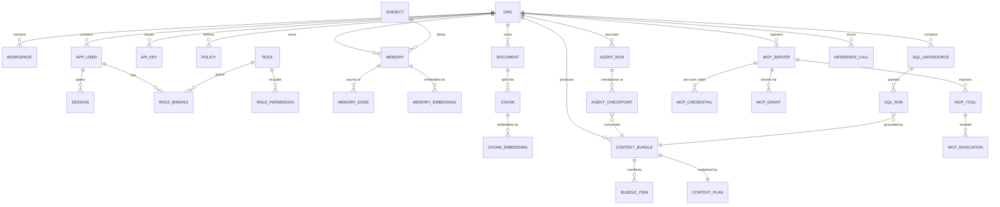

# Database Design

**Stores:** PostgreSQL 16 (+ `pgvector`, `pg_trgm`, `btree_gist`) — system of record.
Neo4j 5 — graph projection. Redis 7 — cache, locks, buckets, working memory.
S3-compatible object store — raw artifacts.

**Governing rule:** PostgreSQL is authoritative. Neo4j, the vector index, and the read
models are **projections that can be dropped and rebuilt** from the Postgres claim log
and the event stream. This is what lets us avoid distributed transactions entirely.

---

## 1. Conventions

| Convention | Rule |
|---|---|
| Primary keys | `UUIDv7` — time-ordered, so B-tree inserts stay sequential and index bloat stays low. Never bigserial (leaks volume, complicates sharding). |
| Tenant key | Every tenant-scoped table carries `org_id uuid NOT NULL`. No exceptions. |
| Timestamps | `timestamptz` always. `created_at`, `updated_at` on every table. UTC only. |
| Soft state | No `is_deleted` booleans. Lifecycle is modelled explicitly per domain. |
| Enums | PostgreSQL native `ENUM` for closed, slow-changing sets; `text` + check constraint where values are operator-extensible. |
| JSON | `jsonb` only, always validated by a Pydantic model at the application boundary, always with a documented shape. |
| Naming | `snake_case`; tables singular (`memory`, not `memories`); join tables `a_b`. |
| Money | `numeric(18,8)` for USD amounts. Never float. |
| Migrations | Alembic, one logical change per revision, reversible, no data-destructive step without an explicit guarded flag. |

## 2. Entity overview



## 3. Identity and tenancy

```sql
CREATE TABLE org (
    id                uuid PRIMARY KEY,
    slug              citext NOT NULL UNIQUE,
    display_name      text NOT NULL,
    residency_region  text NOT NULL DEFAULT 'global',
    status            org_status NOT NULL DEFAULT 'active',
    settings          jsonb NOT NULL DEFAULT '{}'::jsonb,
    created_at        timestamptz NOT NULL DEFAULT now(),
    updated_at        timestamptz NOT NULL DEFAULT now()
);

CREATE TABLE workspace (
    id          uuid PRIMARY KEY,
    org_id      uuid NOT NULL REFERENCES org(id) ON DELETE RESTRICT,
    slug        citext NOT NULL,
    display_name text NOT NULL,
    created_at  timestamptz NOT NULL DEFAULT now(),
    updated_at  timestamptz NOT NULL DEFAULT now(),
    UNIQUE (org_id, slug)
);

CREATE TABLE app_user (
    id             uuid PRIMARY KEY,
    org_id         uuid NOT NULL REFERENCES org(id) ON DELETE RESTRICT,
    email          citext NOT NULL,
    display_name   text,
    external_subject text,              -- IdP `sub`, for federated identity
    identity_provider_id uuid REFERENCES identity_provider(id),
    password_hash  text,                -- argon2id; NULL for federated-only users
    status         user_status NOT NULL DEFAULT 'active',
    created_at     timestamptz NOT NULL DEFAULT now(),
    updated_at     timestamptz NOT NULL DEFAULT now(),
    UNIQUE (org_id, email),
    UNIQUE (identity_provider_id, external_subject)
);
```

`ON DELETE RESTRICT` rather than `CASCADE` on tenant roots is deliberate: deleting an
organization must be an explicit, audited, multi-step workflow, not a foreign-key side
effect. A cascade delete on `org` would silently erase every memory, bundle, and audit
record in a single statement.

### API keys

```sql
CREATE TABLE api_key (
    id            uuid PRIMARY KEY,
    org_id        uuid NOT NULL REFERENCES org(id) ON DELETE RESTRICT,
    key_id        text NOT NULL UNIQUE,      -- public half, e.g. mn_live_7Fq2…
    secret_hash   text NOT NULL,             -- argon2id of the secret half
    name          text NOT NULL,
    scopes        text[] NOT NULL DEFAULT '{}',
    created_by    uuid NOT NULL REFERENCES app_user(id),
    last_used_at  timestamptz,
    expires_at    timestamptz,
    revoked_at    timestamptz,
    created_at    timestamptz NOT NULL DEFAULT now()
);
CREATE INDEX ON api_key (org_id) WHERE revoked_at IS NULL;
```

Split key design (`key_id` public, secret hashed) allows an **indexed lookup by
`key_id`** followed by a single hash verification. Hashing the whole key would force a
full-table scan with a hash comparison per row. Revocation and expiry are checked on
**every** request against the live row — never trusted from a cached JWT claim, because
a revoked key that remains valid until token expiry is an unacceptable window.

### Authorization

```sql
CREATE TABLE role (
    id          uuid PRIMARY KEY,
    org_id      uuid REFERENCES org(id) ON DELETE RESTRICT,  -- NULL = system role
    name        text NOT NULL,
    is_protected boolean NOT NULL DEFAULT false,  -- external IdPs may never grant these
    created_at  timestamptz NOT NULL DEFAULT now(),
    UNIQUE (org_id, name)
);

CREATE TABLE role_binding (
    id            uuid PRIMARY KEY,
    org_id        uuid NOT NULL REFERENCES org(id),
    role_id       uuid NOT NULL REFERENCES role(id) ON DELETE CASCADE,
    principal_type principal_type NOT NULL,     -- 'user' | 'api_key' | 'agent'
    principal_id  uuid NOT NULL,
    scope_type    scope_type NOT NULL,          -- 'org' | 'workspace'
    scope_id      uuid,
    granted_by    uuid REFERENCES app_user(id),
    granted_at    timestamptz NOT NULL DEFAULT now(),
    expires_at    timestamptz,
    UNIQUE (org_id, role_id, principal_type, principal_id, scope_type, scope_id)
);
```

`is_protected` implements the **federated privilege-escalation guard**: roles marked
protected can only be granted by an internal administrator, never derived from an
external IdP's token claims. A misconfigured or compromised enterprise IdP must not be
able to mint platform administrators.

### Row-level security

```sql
ALTER TABLE memory ENABLE ROW LEVEL SECURITY;
ALTER TABLE memory FORCE  ROW LEVEL SECURITY;

CREATE POLICY memory_tenant_isolation ON memory
    USING      (org_id = current_setting('app.current_org', true)::uuid)
    WITH CHECK (org_id = current_setting('app.current_org', true)::uuid);
```

Applied to every tenant-scoped table. `FORCE` matters: without it the table owner
bypasses RLS, and the application role is frequently the owner in practice.

The GUC is set once per transaction by the unit-of-work when it checks out a
connection. This is **defense in depth, not the primary control** — repositories filter
by `org_id` explicitly. RLS is the backstop for the day someone forgets, which is a
question of when rather than whether.

## 4. Memory — the bitemporal core

This is the schema element most worth reading carefully. It is also the one that is
most expensive to change later.

```sql
CREATE TYPE memory_kind AS ENUM (
    'working', 'conversation', 'episodic', 'semantic',
    'procedural', 'profile', 'reflection', 'workspace'
);

CREATE TABLE memory (
    id              uuid PRIMARY KEY,
    org_id          uuid NOT NULL,
    workspace_id    uuid,
    kind            memory_kind NOT NULL,

    -- The claim
    subject_id      uuid NOT NULL REFERENCES subject(id),
    predicate       text NOT NULL,
    object_text     text NOT NULL,
    payload         jsonb NOT NULL DEFAULT '{}'::jsonb,   -- kind-specific, Pydantic-validated

    -- Scope (participates in the uniqueness/exclusion key)
    scope_hash      bytea NOT NULL,      -- sha256 of canonical (workspace, session, tags)
    sensitivity     sensitivity_level NOT NULL DEFAULT 'internal',
    tags            text[] NOT NULL DEFAULT '{}',

    -- WORLD TIME — when the asserted fact holds
    valid_range     tstzrange NOT NULL DEFAULT tstzrange(now(), NULL, '[)'),

    -- BELIEF TIME — when the system held this belief
    recorded_at     timestamptz NOT NULL DEFAULT now(),
    retracted_at    timestamptz,          -- NULL ⇒ currently asserted

    -- Provenance
    source_kind     source_kind NOT NULL,           -- 'user' | 'agent' | 'document' | 'tool' | 'derived'
    source_ref      text,
    trust_tier      smallint NOT NULL CHECK (trust_tier BETWEEN 0 AND 6),
    confidence      real NOT NULL DEFAULT 1.0 CHECK (confidence BETWEEN 0 AND 1),

    -- Lifecycle
    importance      real NOT NULL DEFAULT 0.5,
    strength        real NOT NULL DEFAULT 1.0,
    access_count    integer NOT NULL DEFAULT 0,
    last_accessed_at timestamptz,
    last_reinforced_at timestamptz,
    tombstoned_at   timestamptz,          -- compacted into a reflection
    compacted_into  uuid REFERENCES memory(id),

    content_hash    bytea NOT NULL,       -- sha256 of canonical claim, for dedup
    created_at      timestamptz NOT NULL DEFAULT now(),
    updated_at      timestamptz NOT NULL DEFAULT now()
);
```

### The invariant that makes bitemporality real

```sql
CREATE EXTENSION IF NOT EXISTS btree_gist;

ALTER TABLE memory ADD CONSTRAINT memory_no_overlapping_validity
EXCLUDE USING gist (
    org_id     WITH =,
    subject_id WITH =,
    predicate  WITH =,
    scope_hash WITH =,
    valid_range WITH &&
)
WHERE (retracted_at IS NULL
       AND tombstoned_at IS NULL
       AND kind IN ('semantic', 'profile', 'procedural'));
```

**Read that `WHERE` clause carefully — it encodes a real domain distinction.**

Two `semantic` claims that "the user's default region is EU" and "…is US" cannot both
hold over overlapping world-time intervals; that is a contradiction the database itself
should refuse. But two `episodic` memories about the same subject at the same time are
perfectly normal — a person can do two things at once. Applying the constraint to
episodic memory would be a modelling error that manifests as spurious insert failures
under concurrent ingestion.

**Known PostgreSQL limitation:** exclusion constraints are not supported on partitioned
tables. When `memory` is hash-partitioned at Stage 2 (see
[SystemDesign §7](SystemDesign.md#7-scaling-plan)), the constraint must be created on
each partition individually. Because `org_id` is a partition key **and** a leading
constraint column, per-partition constraints are collectively equivalent to the global
one — a claim for a given org can only ever land in one partition. This is recorded so
that the future partitioning migration does not silently drop the invariant.

### Indexes

```sql
-- Primary retrieval path: asserted claims for a subject, as of a point in time
CREATE INDEX memory_subject_asserted_idx ON memory (org_id, subject_id, kind)
    INCLUDE (importance, strength)
    WHERE retracted_at IS NULL AND tombstoned_at IS NULL;

-- Bitemporal "as of" queries
CREATE INDEX memory_valid_range_idx ON memory USING gist (org_id, valid_range)
    WHERE retracted_at IS NULL;
CREATE INDEX memory_belief_time_idx ON memory (org_id, recorded_at, retracted_at);

-- Deduplication
CREATE UNIQUE INDEX memory_content_hash_idx ON memory (org_id, content_hash)
    WHERE retracted_at IS NULL AND tombstoned_at IS NULL;

-- Lifecycle sweeps
CREATE INDEX memory_decay_sweep_idx ON memory (org_id, kind, strength)
    WHERE retracted_at IS NULL AND tombstoned_at IS NULL;

-- Lexical retrieval
CREATE INDEX memory_fts_idx ON memory
    USING gin (to_tsvector('english', object_text));
CREATE INDEX memory_trgm_idx ON memory
    USING gin (object_text gin_trgm_ops);

-- ACL pushdown support (see §4.3)
CREATE INDEX memory_acl_idx ON memory (org_id, workspace_id, sensitivity)
    WHERE retracted_at IS NULL AND tombstoned_at IS NULL;
```

Partial indexes on `retracted_at IS NULL` matter more than they might appear. In a
non-destructive store, retracted rows accumulate without bound and will eventually
dominate the table. Every hot-path index must exclude them or the index degrades in
proportion to history rather than to live data.

### Claim lineage

```sql
CREATE TYPE memory_edge_kind AS ENUM (
    'supersedes', 'contradicts', 'refines', 'derived_from', 'mentions', 'about'
);

CREATE TABLE memory_edge (
    id          uuid PRIMARY KEY,
    org_id      uuid NOT NULL,
    source_id   uuid NOT NULL REFERENCES memory(id) ON DELETE RESTRICT,
    target_id   uuid NOT NULL REFERENCES memory(id) ON DELETE RESTRICT,
    kind        memory_edge_kind NOT NULL,
    confidence  real NOT NULL DEFAULT 1.0,
    created_by  source_kind NOT NULL,
    created_at  timestamptz NOT NULL DEFAULT now(),
    UNIQUE (source_id, target_id, kind),
    CHECK (source_id <> target_id)
);
CREATE INDEX ON memory_edge (org_id, target_id, kind);
```

This table — not Neo4j — is the source of truth for lineage. Neo4j is the projection
that makes multi-hop traversal fast. If the two ever disagree, Postgres wins and the
projection is rebuilt.

### Embeddings

```sql
CREATE TABLE embedding_space (
    id          uuid PRIMARY KEY,
    org_id      uuid,                 -- NULL = global space
    name        text NOT NULL,
    model       text NOT NULL,
    dimensions  integer NOT NULL,
    distance    text NOT NULL DEFAULT 'cosine',
    is_active   boolean NOT NULL DEFAULT true,
    created_at  timestamptz NOT NULL DEFAULT now(),
    UNIQUE (org_id, name, model)
);

CREATE TABLE memory_embedding (
    id          uuid PRIMARY KEY,
    org_id      uuid NOT NULL,
    memory_id   uuid NOT NULL REFERENCES memory(id) ON DELETE CASCADE,
    space_id    uuid NOT NULL REFERENCES embedding_space(id),
    vec         halfvec(1536) NOT NULL,
    -- Denormalized ACL columns so the authorization predicate can be pushed
    -- into the ANN scan rather than applied after ranking. See ADR-0004.
    workspace_id uuid,
    sensitivity sensitivity_level NOT NULL,
    tags        text[] NOT NULL DEFAULT '{}',
    created_at  timestamptz NOT NULL DEFAULT now(),
    UNIQUE (memory_id, space_id)
);

CREATE INDEX memory_embedding_hnsw_idx ON memory_embedding
    USING hnsw (vec halfvec_cosine_ops)
    WITH (m = 16, ef_construction = 64);

CREATE INDEX memory_embedding_acl_idx ON memory_embedding
    (org_id, workspace_id, sensitivity);
```

Three decisions embedded here:

1. **`halfvec` rather than `vector`.** Half-precision halves index memory with
   negligible recall loss at these dimensions, and raises pgvector's HNSW dimension
   ceiling from 2000 to 4000 — which keeps larger embedding models available without a
   schema migration.
2. **ACL columns are denormalized onto the embedding row.** This is intentional
   denormalization, and it is the entire point: the authorization predicate must be
   evaluable *inside* the index scan. Joining to `memory` to check permissions would
   force post-filtering, which is banned (Architecture P3, §8.1).
3. **`ON DELETE CASCADE` here, unlike elsewhere.** An embedding is a derived artifact
   with no independent meaning; it should not outlive its memory.

**Filtered-ANN recall.** HNSW traversal with a selective filter can exhaust its
candidate list before finding enough matching neighbours. Mnemos therefore enables
pgvector iterative index scans with a bounded `hnsw.max_scan_tuples`, and the physical
planner falls back to an exact scan within the org partition when estimated selectivity
drops below a configured threshold. The planner knows the selectivity because the
statistics catalog tracks it.

## 5. Documents and chunks

```sql
CREATE TABLE document (
    id            uuid PRIMARY KEY,
    org_id        uuid NOT NULL,
    workspace_id  uuid,
    source_uri    text NOT NULL,
    content_hash  bytea NOT NULL,
    mime_type     text NOT NULL,
    title         text,
    sensitivity   sensitivity_level NOT NULL DEFAULT 'internal',
    trust_tier    smallint NOT NULL,
    object_key    text NOT NULL,             -- raw artifact in object store
    ingest_status ingest_status NOT NULL DEFAULT 'pending',
    ingest_error  text,
    metadata      jsonb NOT NULL DEFAULT '{}'::jsonb,
    created_at    timestamptz NOT NULL DEFAULT now(),
    updated_at    timestamptz NOT NULL DEFAULT now(),
    UNIQUE (org_id, content_hash)
);

CREATE TABLE chunk (
    id            uuid PRIMARY KEY,
    org_id        uuid NOT NULL,
    document_id   uuid NOT NULL REFERENCES document(id) ON DELETE CASCADE,
    ordinal       integer NOT NULL,
    content       text NOT NULL,
    token_count   integer NOT NULL,
    char_start    integer NOT NULL,          -- offsets into the source, for citation
    char_end      integer NOT NULL,
    heading_path  text[],                    -- structural breadcrumb
    workspace_id  uuid,                      -- denormalized for ACL pushdown
    sensitivity   sensitivity_level NOT NULL,
    created_at    timestamptz NOT NULL DEFAULT now(),
    UNIQUE (document_id, ordinal)
);
```

`char_start` / `char_end` and `heading_path` exist so a retrieved chunk can be cited
back to an exact location in the source document. Without them, provenance stops at
"some chunk of this file", which is not provenance — and the dashboard's highlight view
becomes impossible to build later without reprocessing the whole corpus.

## 6. Context bundles — the provenance record

```sql
CREATE TABLE context_bundle (
    id                uuid PRIMARY KEY,
    org_id            uuid NOT NULL,
    digest            bytea NOT NULL,       -- sha256 over canonical (sections ‖ manifest)
    session_id        uuid,
    principal_id      uuid NOT NULL,
    agent_role        text,
    request_digest    bytea NOT NULL,
    catalog_version   integer NOT NULL,
    policy_version    integer NOT NULL,
    template_version  text NOT NULL,

    tokens_requested  integer NOT NULL,
    tokens_consumed   integer NOT NULL,
    compute_units_consumed numeric(18,8) NOT NULL DEFAULT 0,
    usd_consumed      numeric(18,8) NOT NULL DEFAULT 0,  -- 0 under local inference
    latency_ms        integer NOT NULL,

    sections          jsonb NOT NULL,       -- ordered, fenced, token-counted
    budget_report     jsonb NOT NULL,       -- per-resource requested vs consumed + evictions
    degradations      jsonb NOT NULL DEFAULT '[]'::jsonb,
    created_at        timestamptz NOT NULL DEFAULT now(),
    UNIQUE (org_id, digest)
);

CREATE TABLE bundle_item (
    id            uuid PRIMARY KEY,
    org_id        uuid NOT NULL,
    bundle_id     uuid NOT NULL REFERENCES context_bundle(id) ON DELETE CASCADE,
    section       text NOT NULL,
    ordinal       integer NOT NULL,
    source_kind   text NOT NULL,            -- 'memory' | 'chunk' | 'graph' | 'turn'
    source_id     uuid NOT NULL,
    source_version integer,
    operator_id   text NOT NULL,            -- which plan operator produced it
    score         double precision NOT NULL,
    rank_before_rerank integer,
    token_count   integer NOT NULL,
    trust_tier    smallint NOT NULL,
    acl_rule_id   uuid NOT NULL,            -- the policy rule that ADMITTED this item
    compression   text,                     -- null | 'truncate' | 'extractive' | 'abstractive'
    UNIQUE (bundle_id, section, ordinal)
);
CREATE INDEX ON bundle_item (org_id, source_kind, source_id);

CREATE TABLE context_plan (
    bundle_id     uuid PRIMARY KEY REFERENCES context_bundle(id) ON DELETE CASCADE,
    org_id        uuid NOT NULL,
    plan_hash     bytea NOT NULL,
    logical_plan  jsonb NOT NULL,
    physical_plan jsonb NOT NULL,
    operator_actuals jsonb NOT NULL,        -- per-operator latency, in/out, usd
    allocator_trace  jsonb NOT NULL,        -- admissions, evictions, and reasons
    created_at    timestamptz NOT NULL DEFAULT now()
);
```

`bundle_item.acl_rule_id` is the column that turns "we do authorization" into "we can
prove which rule admitted this token." During an audit or an incident, being able to
answer *"why did this document appear in this user's context?"* with a rule ID rather
than a shrug is the difference between a controlled system and an anecdote.

The reverse index on `(source_kind, source_id)` answers the other audit question —
*"every context this document ever entered"* — which is a prerequisite for a credible
data-subject-access response.

**Retention.** Bundles are large and grow linearly with traffic. Default policy: full
bundle for 30 days, then `sections` dropped while manifest and plan are retained for
1 year, then aggregate only. Configurable per org; the DSR erase path removes bundle
items referencing erased sources.

## 7. Agent runtime

```sql
CREATE TABLE agent_run (
    id            uuid PRIMARY KEY,
    org_id        uuid NOT NULL,
    session_id    uuid,
    principal_id  uuid NOT NULL,
    agent_def_id  uuid NOT NULL REFERENCES agent_definition(id),
    state         agent_state NOT NULL DEFAULT 'plan',
    goal          text NOT NULL,
    -- budgets are persisted, not in-memory: the runtime enforces them across restarts
    budget        jsonb NOT NULL,   -- {steps, replans, retries, usd, tokens, wallclock_s}
    consumed      jsonb NOT NULL DEFAULT '{}'::jsonb,
    result        jsonb,
    error         jsonb,
    resume_token  text,             -- for AWAITING_APPROVAL
    started_at    timestamptz NOT NULL DEFAULT now(),
    ended_at      timestamptz,
    updated_at    timestamptz NOT NULL DEFAULT now()
);
CREATE INDEX ON agent_run (org_id, state) WHERE ended_at IS NULL;

CREATE TABLE agent_checkpoint (
    id            uuid PRIMARY KEY,
    org_id        uuid NOT NULL,
    run_id        uuid NOT NULL REFERENCES agent_run(id) ON DELETE CASCADE,
    seq           integer NOT NULL,
    from_state    agent_state NOT NULL,
    to_state      agent_state NOT NULL,
    bundle_digest bytea,            -- the EXACT context this step consumed
    step_input    jsonb NOT NULL,
    step_output   jsonb,
    tool_calls    jsonb NOT NULL DEFAULT '[]'::jsonb,
    authz_decisions jsonb NOT NULL DEFAULT '[]'::jsonb,
    min_trust_tier smallint,        -- lowest tier present in the motivating context
    usd_consumed  numeric(18,8) NOT NULL DEFAULT 0,
    created_at    timestamptz NOT NULL DEFAULT now(),
    UNIQUE (run_id, seq)
);
```

`min_trust_tier` on the checkpoint is the persisted evidence for the tool-boundary
re-authorization described in [Architecture §8.3](Architecture.md#83-trust-tiers-and-prompt-injection-containment).
It is stored, not merely computed, so that an after-the-fact audit can verify the
decision was made with the right inputs.

## 8. Inference gateway and compute accounting

```sql
CREATE TABLE inference_call (
    id              uuid PRIMARY KEY,
    org_id          uuid NOT NULL,
    principal_id    uuid,
    session_id      uuid,
    run_id          uuid,
    bundle_digest   bytea,
    route_id        uuid REFERENCES inference_route(id),
    provider        text NOT NULL,      -- 'ollama' | 'sentence_transformers' | 'openai' | …
    provider_class  text NOT NULL,      -- 'local' | 'hosted'
    model           text NOT NULL,
    role            text NOT NULL,      -- 'embedding' | 'rerank' | 'generation' | 'classification'
    purpose         text NOT NULL,      -- 'intent' | 'rerank' | 'compress' | 'agent' | 'sql_gen' | …
    prompt_tokens   integer NOT NULL DEFAULT 0,
    completion_tokens integer NOT NULL DEFAULT 0,
    cached_tokens   integer NOT NULL DEFAULT 0,
    -- Provider-agnostic cost. usd_cost is 0 for local providers; compute_units is
    -- always populated. Both are recorded so a deployment can switch from free to
    -- paid without losing historical comparability.
    compute_units   numeric(18,8) NOT NULL,
    usd_cost        numeric(18,8) NOT NULL DEFAULT 0,
    latency_ms      integer NOT NULL,
    outcome         text NOT NULL,      -- 'ok' | 'error' | 'timeout' | 'circuit_open'
    attempt         smallint NOT NULL DEFAULT 1,
    cache_outcome   text NOT NULL,      -- 'miss' | 'exact_hit' | 'semantic_hit'
    created_at      timestamptz NOT NULL DEFAULT now()
) PARTITION BY RANGE (created_at);

CREATE INDEX ON inference_call (org_id, created_at DESC);
CREATE INDEX ON inference_call (org_id, purpose, created_at DESC);
CREATE INDEX ON inference_call (org_id, provider_class, role, created_at DESC);
```

Append-only and deliberately wide: this is the single table from which compute
attribution, routing effectiveness, cache hit rate, and provider reliability are all
derived. Partitioned monthly from the start, because it is the fastest-growing table in
the system and retention pruning must be a partition drop rather than a mass `DELETE`.

**Why both `compute_units` and `usd_cost`.** The default deployment is free, so
`usd_cost` is always zero — but recording only wall-clock time would make the ledger
incomparable the moment a hosted key is added. `compute_units` is normalized against a
calibration benchmark taken at startup, so a local 3B generation and a hosted call are
expressed in the same unit and the budget allocator's arithmetic is unchanged. This is
also what feeds `operator_stats.est_compute_units` in §9.

## 8.5 Flow-specific schema

The kernel tables above are flow-agnostic. Each flow adds only what is genuinely
specific to it — if a flow needed to duplicate retrieval or authorization state, that
would be evidence the kernel abstraction had failed.

### Flow B — NL2SQL

```sql
CREATE TABLE sql_datasource (
    id              uuid PRIMARY KEY,
    org_id          uuid NOT NULL,
    name            text NOT NULL,
    dialect         sql_dialect NOT NULL,        -- 'sqlite' | 'postgres' | (ext: snowflake…)
    dsn_encrypted   bytea NOT NULL,              -- AES-GCM under the org data key
    dsn_key_version integer NOT NULL,
    read_only_user  boolean NOT NULL DEFAULT true,
    statement_timeout_ms integer NOT NULL DEFAULT 30000,
    max_rows        integer NOT NULL DEFAULT 10000,
    status          text NOT NULL DEFAULT 'active',
    last_introspected_at timestamptz,
    created_at      timestamptz NOT NULL DEFAULT now(),
    UNIQUE (org_id, name)
);

-- Schema metadata is NOT a bespoke table. Tables and columns are stored as
-- memory claims of kind 'semantic' with predicate 'has_table' / 'has_column',
-- which means schema drift gets bitemporal versioning for free: you can ask
-- "what did this warehouse's schema look like on 2026-03-01?" with no extra code.

CREATE TABLE sql_run (
    id              uuid PRIMARY KEY,
    org_id          uuid NOT NULL,
    datasource_id   uuid NOT NULL REFERENCES sql_datasource(id),
    principal_id    uuid NOT NULL,
    session_id      uuid,
    bundle_digest   bytea NOT NULL,              -- the context that produced the SQL
    question        text NOT NULL,
    generated_sql   text,
    sql_ast_hash    bytea,
    -- Safety verdicts, recorded per attempt, not just the final one
    readonly_verdict text NOT NULL,              -- 'pass' | 'reject_dml' | 'reject_unparseable'
    authorized_tables text[] NOT NULL DEFAULT '{}',
    denied_tables   text[] NOT NULL DEFAULT '{}',
    attempt         smallint NOT NULL DEFAULT 1,
    repair_budget_remaining smallint NOT NULL,
    outcome         text NOT NULL,               -- 'ok'|'denied'|'invalid_sql'|'exec_error'|'timeout'
    row_count       integer,
    latency_ms      integer,
    created_at      timestamptz NOT NULL DEFAULT now()
);
CREATE INDEX ON sql_run (org_id, created_at DESC);
```

`readonly_verdict` and `denied_tables` are persisted **per attempt**. A repair loop that
smuggles a DML statement into attempt 3 must be visible in the record; storing only the
final attempt would hide exactly the failure the AST guard exists to catch.

Storing schema as memory claims rather than a `table_metadata` table is the single
highest-leverage reuse decision in this flow — it means schema retrieval, ACL pushdown,
and temporal versioning are all inherited from the kernel rather than rebuilt.

### Flow C — MCP / tools (separate entity)

```sql
CREATE TABLE mcp_server (
    id              uuid PRIMARY KEY,
    org_id          uuid NOT NULL,
    name            text NOT NULL,
    kind            mcp_server_kind NOT NULL,    -- 'remote' | 'generated' | 'builtin'
    transport       mcp_transport NOT NULL,      -- 'sse' | 'streamable_http' | 'stdio'
    endpoint_url    text,
    auth_kind       text NOT NULL,               -- 'none' | 'oauth2' | 'api_key' | 'passthrough'
    oauth_client_id text,
    oauth_metadata  jsonb,                       -- from dynamic client registration
    spec_object_key text,                        -- for 'generated': source OpenAPI spec
    health_status   text NOT NULL DEFAULT 'unknown',
    last_health_at  timestamptz,
    created_by      uuid NOT NULL REFERENCES app_user(id),
    created_at      timestamptz NOT NULL DEFAULT now(),
    UNIQUE (org_id, name)
);

CREATE TABLE mcp_tool (
    id              uuid PRIMARY KEY,
    org_id          uuid NOT NULL,
    server_id       uuid NOT NULL REFERENCES mcp_server(id) ON DELETE CASCADE,
    name            text NOT NULL,
    description     text NOT NULL,
    input_schema    jsonb NOT NULL,              -- JSON Schema, validated before dispatch
    side_effect     tool_side_effect NOT NULL,   -- 'read' | 'write' | 'external'
    -- Minimum trust tier of the motivating context required to invoke this tool.
    -- See Architecture §8.3 — a tool call motivated by scraped content cannot
    -- exercise user-tier permissions.
    min_trust_tier  smallint NOT NULL DEFAULT 2,
    requires_approval boolean NOT NULL DEFAULT false,
    enabled         boolean NOT NULL DEFAULT true,
    discovered_at   timestamptz NOT NULL DEFAULT now(),
    UNIQUE (server_id, name)
);

-- Per-user credential isolation: tools execute AS the calling user, never as a
-- shared service identity. One row per (user, server).
CREATE TABLE mcp_credential (
    id              uuid PRIMARY KEY,
    org_id          uuid NOT NULL,
    server_id       uuid NOT NULL REFERENCES mcp_server(id) ON DELETE CASCADE,
    principal_id    uuid NOT NULL,
    secret_encrypted bytea NOT NULL,             -- AES-GCM under the org data key
    key_version     integer NOT NULL,
    token_expires_at timestamptz,
    refresh_encrypted bytea,
    created_at      timestamptz NOT NULL DEFAULT now(),
    UNIQUE (server_id, principal_id)
);

CREATE TABLE mcp_grant (
    id              uuid PRIMARY KEY,
    org_id          uuid NOT NULL,
    server_id       uuid NOT NULL REFERENCES mcp_server(id) ON DELETE CASCADE,
    grantee_type    text NOT NULL,               -- 'user' | 'role' | 'org'
    grantee_id      uuid,
    access          text NOT NULL,               -- 'owner' | 'use' | 'none'
    granted_by      uuid NOT NULL REFERENCES app_user(id),
    granted_at      timestamptz NOT NULL DEFAULT now(),
    UNIQUE (server_id, grantee_type, grantee_id)
);

CREATE TABLE mcp_invocation (
    id              uuid PRIMARY KEY,
    org_id          uuid NOT NULL,
    tool_id         uuid NOT NULL REFERENCES mcp_tool(id),
    principal_id    uuid NOT NULL,
    run_id          uuid,
    checkpoint_id   uuid,
    bundle_digest   bytea,
    motivating_trust_tier smallint NOT NULL,     -- evidence for the authz decision
    authz_outcome   text NOT NULL,               -- 'allow' | 'deny_trust_tier' | 'deny_grant' | …
    authz_rule_id   uuid,
    arguments_redacted jsonb NOT NULL,
    outcome         text NOT NULL,
    latency_ms      integer,
    created_at      timestamptz NOT NULL DEFAULT now()
);
CREATE INDEX ON mcp_invocation (org_id, created_at DESC);
CREATE INDEX ON mcp_invocation (org_id, principal_id, created_at DESC);
```

`mcp_grant` deliberately mirrors the owner / role-shared / user-shared / admin model
rather than inventing a new one — but note what is **not** here: there is no cached copy
of the caller's roles. Access is resolved by joining `mcp_grant` against live
`role_binding` rows on every invocation. A role cached at connection time is a forged
header waiting to happen.

`mcp_invocation.motivating_trust_tier` is stored, not merely computed, so an audit can
verify after the fact that the trust-tier check ran with the correct input.

## 9. Statistics catalog — the `ANALYZE` of the compiler

```sql
CREATE TABLE operator_stats (
    id              uuid PRIMARY KEY,
    org_id          uuid,               -- NULL = global prior (cold start)
    operator_kind   text NOT NULL,
    space_id        uuid,
    latency_p50_ms  real NOT NULL,
    latency_p95_ms  real NOT NULL,
    est_compute_units numeric(18,8) NOT NULL DEFAULT 0,
    selectivity     real NOT NULL,      -- fraction surviving the ACL predicate
    avg_candidates  real NOT NULL,
    avg_tokens_out  real NOT NULL,
    utility_prior   real NOT NULL,      -- EWMA of downstream contribution
    sample_count    bigint NOT NULL,
    catalog_version integer NOT NULL,
    refreshed_at    timestamptz NOT NULL DEFAULT now(),
    UNIQUE (org_id, operator_kind, space_id)
);
```

Refreshed by a scheduled job from OpenTelemetry span aggregates and feedback signals.
`utility_prior` is an exponentially-weighted moving average of how much an operator's
output actually contributed to bundles that received positive downstream signal —
this is what closes the loop and makes the optimizer improve rather than merely
execute. Cold start uses the global `org_id IS NULL` row.

`catalog_version` increments on every refresh and participates in bundle cache keys, so
a statistics refresh cannot serve a stale plan.

## 10. Event infrastructure

```sql
CREATE TABLE outbox (
    id              uuid PRIMARY KEY,
    org_id          uuid NOT NULL,
    aggregate_type  text NOT NULL,
    aggregate_id    uuid NOT NULL,
    event_type      text NOT NULL,
    event_version   integer NOT NULL DEFAULT 1,
    payload         jsonb NOT NULL,
    trace_id        text,
    occurred_at     timestamptz NOT NULL DEFAULT now(),
    published_at    timestamptz,
    attempts        smallint NOT NULL DEFAULT 0,
    last_error      text
);
CREATE INDEX outbox_unpublished_idx ON outbox (occurred_at)
    WHERE published_at IS NULL;

CREATE TABLE processed_event (
    event_id        uuid NOT NULL,
    consumer_group  text NOT NULL,
    processed_at    timestamptz NOT NULL DEFAULT now(),
    PRIMARY KEY (event_id, consumer_group)
);
```

The outbox is written **in the same transaction as the state change**. Either both
commit or neither does. This is what gives at-least-once event delivery without a
distributed transaction, and it is why RabbitMQ being down never loses an event — only
delays it. `processed_event` gives consumers idempotency, which at-least-once delivery
makes mandatory rather than optional.

The partial index on unpublished rows keeps the relay's poll query `O(unpublished)`
rather than `O(all events ever)`.

## 11. Audit

```sql
CREATE TABLE audit_log (
    id            uuid PRIMARY KEY,
    org_id        uuid NOT NULL,
    actor_type    principal_type NOT NULL,
    actor_id      uuid,
    action        text NOT NULL,
    resource_type text NOT NULL,
    resource_id   uuid,
    outcome       text NOT NULL,          -- 'allow' | 'deny' | 'error'
    rule_id       uuid,                   -- policy rule that decided
    request_id    text,
    trace_id      text,
    ip_address    inet,
    user_agent    text,
    detail        jsonb NOT NULL DEFAULT '{}'::jsonb,
    created_at    timestamptz NOT NULL DEFAULT now()
) PARTITION BY RANGE (created_at);
```

Append-only; no `UPDATE` or `DELETE` grant is issued to the application role. Partitioned
by month for retention management. **Denials are logged with the same fidelity as
allows** — a security log that only records successes cannot detect an attack in
progress.

## 12. Neo4j — graph projection

```cypher
// Node labels
(:Entity   {id, org_id, canonical_name, type, workspace_id, sensitivity})
(:Claim    {id, org_id, predicate, valid_from, valid_to,
            recorded_at, retracted_at, confidence, trust_tier})
(:Document {id, org_id, title, sensitivity, workspace_id})
(:Subject  {id, org_id, kind})

// Relationships
(:Claim)-[:ABOUT]->(:Subject)
(:Claim)-[:MENTIONS]->(:Entity)
(:Claim)-[:SUPERSEDES {at}]->(:Claim)
(:Claim)-[:CONTRADICTS {confidence}]->(:Claim)
(:Claim)-[:DERIVED_FROM]->(:Claim)
(:Claim)-[:SOURCED_FROM]->(:Document)
(:Entity)-[:RELATED_TO {predicate, confidence, valid_from, valid_to}]->(:Entity)

// Constraints and indexes
CREATE CONSTRAINT entity_id  IF NOT EXISTS FOR (e:Entity) REQUIRE e.id IS UNIQUE;
CREATE CONSTRAINT claim_id   IF NOT EXISTS FOR (c:Claim)  REQUIRE c.id IS UNIQUE;
CREATE INDEX entity_org_name IF NOT EXISTS FOR (e:Entity) ON (e.org_id, e.canonical_name);
CREATE INDEX claim_org_time  IF NOT EXISTS FOR (c:Claim)  ON (c.org_id, c.recorded_at);
```

**Every traversal is org-scoped in the pattern itself**, not filtered afterwards —
`MATCH (e:Entity {org_id: $org})` rather than `MATCH (e:Entity) WHERE e.org_id = $org`
applied late. Neo4j has no row-level security, so tenant isolation in the graph is
entirely the query builder's responsibility. That responsibility is centralized in a
single `GraphStore` adapter with no raw-Cypher escape hatch exposed to feature code.

Because the graph is a projection, a full rebuild is a supported operation with a
documented runbook, and projection lag is an explicit SLI.

## 13. Redis keyspace

| Pattern | Type | TTL | Purpose |
|---|---|---|---|
| `mn:{org}:wm:{session}` | Stream | 2 h | Working memory — recent turns, capped length |
| `mn:{org}:policy:{ver}` | String | 15 m | Compiled policy AST |
| `mn:{org}:bucket:{principal}:{res}` | Hash | 1 m | Token bucket (API / spend / concurrency) |
| `mn:{org}:lock:{resource}` | String | 30 s | Distributed lock (SET NX PX + fencing token) |
| `mn:cache:emb:{hash}:{model}` | String | 30 d | Embedding cache |
| `mn:cache:intent:{hash}:{model}` | String | 24 h | Intent signature cache |
| `mn:cache:bundle:{req}:{cat}:{pol}` | String | 5 m | Compiled bundle cache |
| `mn:ws:conn:{node}` | Set | — | WebSocket connection registry |

Every key is prefixed with `mn:` and, where tenant-scoped, with `{org}` — so a
misconfigured shared Redis cannot silently cross tenants, and an org's cache can be
purged with a single scoped scan. Locks carry a fencing token; a lock without one does
not prevent a stalled-then-resumed holder from corrupting state after its lease expired.

## 14. Migration discipline

1. **Expand → migrate → contract.** Never a destructive change in the same release as
   the code that depends on it. Add the column, backfill, dual-write, switch reads, then
   drop — four releases, not one.
2. **`CREATE INDEX CONCURRENTLY`** for any index on a table with production volume;
   Alembic revision marked non-transactional.
3. **No `ALTER TYPE … ADD VALUE`** inside a transaction with other DDL — PostgreSQL
   restricts its use in the same transaction. New enum values ship in their own revision.
4. **Backfills are batched, resumable jobs**, never inline in a migration. A migration
   that rewrites ten million rows holds a lock long enough to constitute an outage.
5. **Every revision has a tested downgrade**, verified in CI against a seeded database.
   A downgrade that has never been executed is a hope, not a rollback plan.
