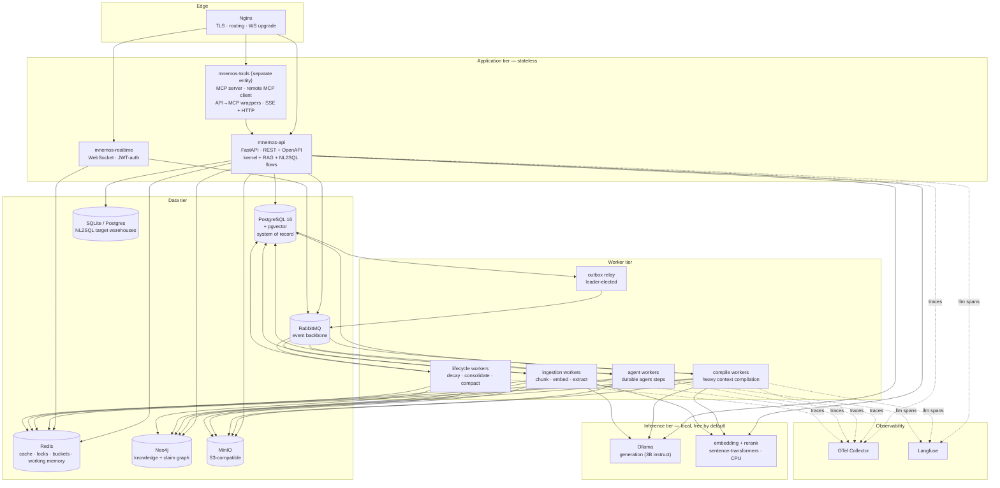
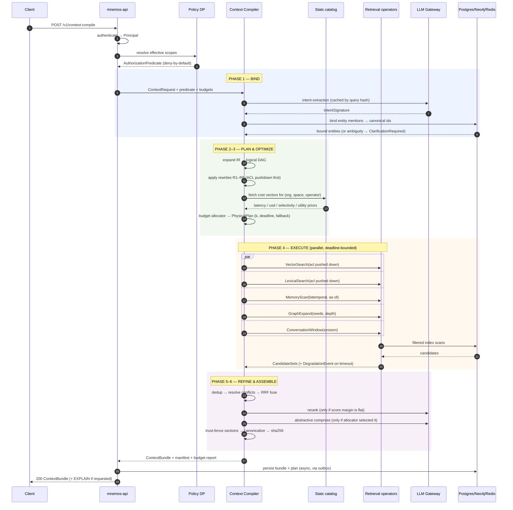
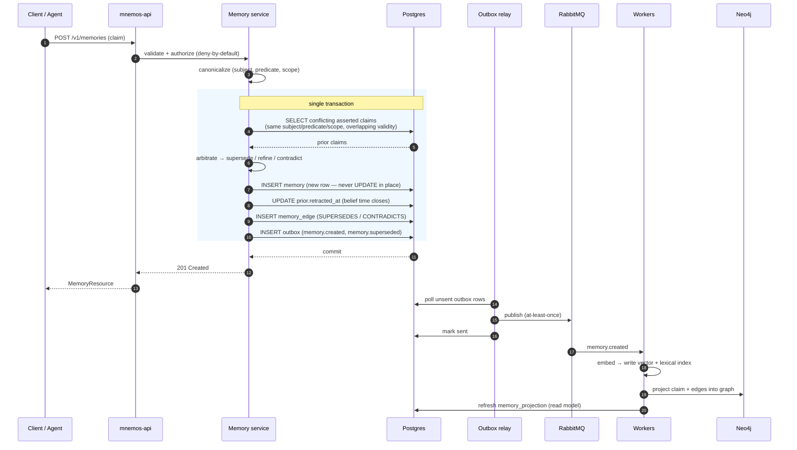
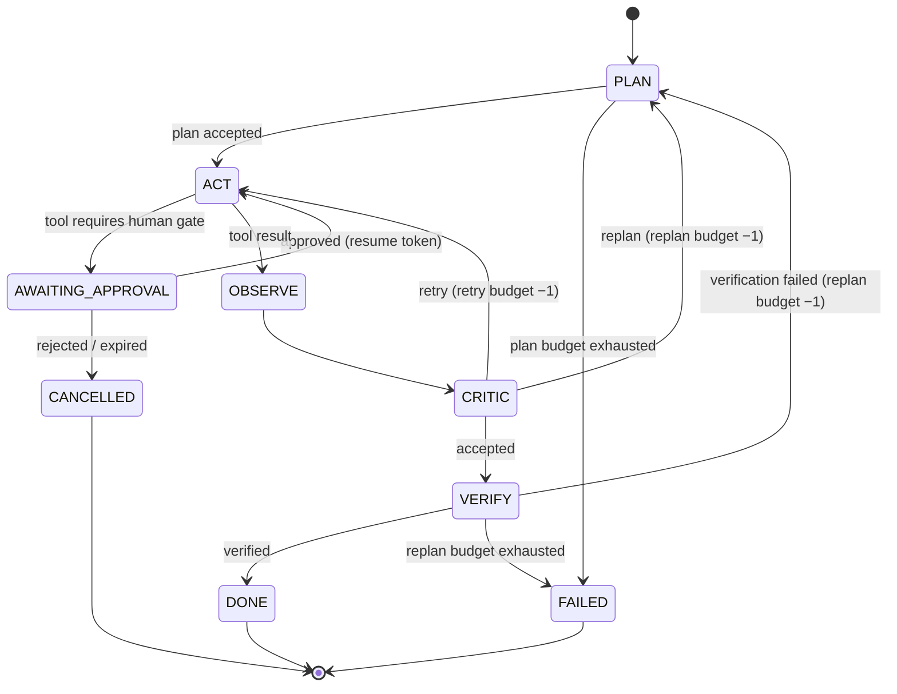

# System Design

**Companion to:** [Architecture.md](Architecture.md) — that document explains *why*;
this one explains *what runs where, and what happens when it breaks*.

---

## 1. Runtime topology



**Every component above is free and self-hostable.** Langfuse, MinIO, Neo4j Community,
Ollama, and the sentence-transformers models are all open source. No component in the
default path requires an account, a key, or a credit card. Adding a hosted provider is
a change to `MNEMOS_MODEL_TIER` and a key in the environment — never a code change.

**Neo4j Community Edition constraints, acknowledged up front:** no multi-database, no
Fabric sharding, no native RBAC. Consequences: tenant isolation in the graph is enforced
entirely by org-scoped query patterns in the single `GraphStore` adapter (§12 of
[DatabaseDesign](DatabaseDesign.md)), and the graph-sharding step in the scaling plan is
design intent that CE cannot execute. Both are stated rather than glossed over.

### Service responsibilities

| Service | Responsibility | Scaling signal | State |
|---|---|---|---|
| `mnemos-api` | Synchronous REST; fast-path context compilation (< latency budget) | RPS, p95 latency | Stateless |
| `mnemos-realtime` | WebSocket fan-out of pub/sub events to clients | Concurrent connections | Connection registry in Redis |
| `mnemos-tools` | **Separate entity.** MCP server exposing kernel capabilities; remote MCP client (SSE + streamable HTTP, OAuth 2.0); generated API→MCP wrappers | Tool call rate | Credential store; own network boundary |
| `compile workers` | Context compilations exceeding the inline latency budget | Queue depth | Stateless |
| `agent workers` | Durable agent step execution | Queue depth, in-flight runs | Checkpoints in Postgres |
| `ingestion workers` | Chunking, embedding, entity extraction | Queue depth | Stateless |
| `lifecycle workers` | Decay, reinforcement, consolidation, compaction | Scheduled (beat) | Advisory-lock leader |
| `outbox relay` | Publishes committed domain events to RabbitMQ | Outbox lag | Advisory-lock leader |

**Why `compile workers` exist separately from `mnemos-api`.** Context compilation has a
bimodal latency profile: cached/simple compilations finish in tens of milliseconds,
while cold compilations involving graph expansion, cross-encoder reranking, and
abstractive compression take seconds. Serving both from the same process pool means
slow compilations exhaust the connection pool and starve fast requests. The API
compiles inline when the requested latency budget permits and the plan's estimated p95
fits; otherwise it enqueues and returns `202` with a poll/subscribe handle.

## 2. The critical path: compiling a context



### Latency budget decomposition

**These targets assume local, CPU-only inference — the free default.** Hosted-API
numbers would be flattering and irrelevant to how this system actually runs. Two tiers
are given because the difference between them changes which optimization decisions are
correct, not merely how fast things are.

| Phase | `cpu-standard` p50 | `cpu-standard` p95 | `gpu-8gb` p50 | Notes |
|---|---|---|---|---|
| Auth + policy resolution | 2 ms | 8 ms | 2 ms | Compiled policy AST cached in Redis |
| Bind — embedding-classifier intent | **12 ms** | 30 ms | 6 ms | **The default.** Nearest-centroid over intent exemplars |
| Bind — LLM intent (opt-in) | 3.5 s | 9 s | 600 ms | Why it is *not* the default |
| Entity binding | 15 ms | 45 ms | 15 ms | Postgres + Neo4j lookups, parallel |
| Plan + optimize | 4 ms | 15 ms | 4 ms | Pure CPU; `O(n log n)` allocator |
| Execute (parallel operators) | 70 ms | 280 ms | 60 ms | Bounded by slowest operator deadline |
| ↳ embedding of query | 10 ms | 25 ms | 5 ms | `bge-small-en-v1.5`, 384d |
| ↳ pgvector HNSW scan | 8 ms | 40 ms | 8 ms | Filtered, iterative scan |
| ↳ Neo4j 2-hop expand | 25 ms | 120 ms | 25 ms | CE, single instance |
| Refine — no rerank | 8 ms | 25 ms | 8 ms | Dedup + conflict resolution |
| Refine — with rerank (gated) | **420 ms** | 1.1 s | 90 ms | `bge-reranker-base`, 20 pairs |
| Refine — abstractive compress | 6 s | 18 s | 1.2 s | Almost always rejected by the allocator on CPU |
| Assemble | 5 ms | 15 ms | 5 ms | Template render + canonical hash |
| **Total — warm, no rerank** | **~125 ms** | **~420 ms** | **~110 ms** | The design point |
| **Total — cold, rerank fired** | **~550 ms** | **~1.5 s** | **~200 ms** | Still inline |
| **Total — abstractive compress** | **~6.5 s** | **~19 s** | **~1.4 s** | Routed to compile workers, always |

**What this table is actually arguing.** On CPU, one generation call costs 300× an
embedding call. That ratio is the whole reason the compiler exists:

- Intent classification via embeddings rather than generation saves ~3.5 s per request,
  and is *more* deterministic. Resource constraints produced the better design.
- The rerank gate is not a micro-optimization — it decides between a 125 ms and a 550 ms
  response. Firing it on every request would make the system unusable.
- The allocator will reject abstractive compression on CPU essentially always, because
  its cost model says 6 seconds is not worth the token savings. On a GPU tier it starts
  accepting it. **Same code, different decision, driven by measured statistics** — which
  is exactly what a cost-based optimizer is supposed to do, and is a far better
  demonstration than any hardcoded heuristic.

M11 validates or revises these numbers on real hardware. They are recorded now so a
regression has something concrete to fail against.

## 3. Memory write path



**Why the arbitration happens inside the write transaction.** Determining that a new
claim supersedes an old one is a read-modify-write on the same logical key. Doing it
asynchronously creates a window where two contradictory claims are both `asserted`,
which the retrieval path would surface as a spurious conflict. The exclusion constraint
on `(subject, predicate, scope, validity)` is the backstop that makes the invariant
enforceable rather than merely intended.

**Why indexing is asynchronous.** Embedding is a network call to a model provider. Doing
it inline would couple write latency and write availability to a third party. The
consequence — a memory is durable immediately but semantically searchable within
seconds — is documented in the API contract as a stated consistency guarantee, not left
as a surprise.

## 4. Agent run lifecycle



Every transition writes a checkpoint containing the step input, the **`ContextBundle`
digest consumed**, the tool calls proposed, the authorization decisions applied, and the
step output. Two properties follow:

1. **Exact step replay.** Any step can be re-executed against the byte-identical context
   it originally saw — which is the only way to debug an agent failure honestly.
2. **Crash recovery.** A worker dying mid-run loses at most the in-flight step. Runs
   resume from the last checkpoint with budgets intact, because budgets are persisted
   state, not in-memory counters.

**Back-edge budgets are enforced by the runtime, not the prompt.** A model instructed
"try at most 3 times" will not reliably comply. The state machine decrements a
persisted counter and transitions to `FAILED` at zero.

## 5. Consistency model

| Data | Guarantee | Rationale |
|---|---|---|
| Memory claims (Postgres) | Strong, read-your-writes | System of record; arbitration requires serializable reads on the logical key |
| Vector / lexical index | Eventual, seconds | Embedding is an external call; decoupled for write availability |
| Knowledge graph (Neo4j) | Eventual, seconds | Projection built from events; Postgres remains authoritative |
| `memory_projection` read model | Eventual, seconds | CQRS read side, rebuildable from events |
| Context bundles | Immutable once written | Content-addressed; a digest always denotes the same bytes |
| Agent checkpoints | Strong | Correctness of resume depends on it |
| Policy decisions | Strong on write, ≤ TTL stale on read | Compiled AST cached in Redis with explicit invalidation on policy change |

**Neo4j is a projection, never a source of truth.** It can be dropped and rebuilt from
the Postgres claim log. This eliminates cross-store distributed-transaction problems
entirely and gives a clean disaster-recovery story: restore Postgres, replay
projections.

## 6. Failure modes and degradation

The system's stated contract is **degrade, don't fail** (P9). Each dependency has a
defined blast radius.

| Failure | Blast radius | Behaviour | Recovery |
|---|---|---|---|
| Neo4j down | `GraphExpand` only | Operator hits deadline → fallback → bundle marked degraded, graph section absent | Auto on reconnect; projection catches up from outbox |
| Redis down | Cache, locks, buckets, working memory | Cache misses become DB reads; **rate limiting fails closed**; working memory unavailable → degraded bundle | Auto |
| Ollama down (local generation) | Generation, LLM-intent (if opted in), abstractive compression | Circuit breaker opens → fall back to embedding-classifier intent and extractive compression; **retrieval is entirely unaffected** because the default intent path needs no generation | Half-open probe |
| Embedding model unavailable | Vector operator, new memory indexing | Compiler falls back to lexical + memory scan; ingestion queues rather than dropping | Auto |
| Configured hosted provider down | Only routes pinned to it | Circuit breaker → route to local per routing policy. Local is always a valid fallback target | Half-open probe |
| RabbitMQ down | Async projections, ingestion, notifications | Writes still commit (outbox buffers); relay backs off and drains on recovery | Auto, no data loss |
| pgvector index unavailable | Vector operator | Falls back to lexical + memory scan; degraded bundle | Auto |
| Postgres primary down | Everything writable | Reads served from replica where the endpoint permits; writes return `503` with `Retry-After` | Failover |
| Outbox relay stalled | Event freshness | Alert on `outbox_lag_seconds`; no data loss, only staleness | Restart; leader lock re-acquired |
| Compile worker pool saturated | Async compilations | Queue depth alert; `202` responses continue; oldest-first with per-org fair queuing | Scale out |

**Rate limiting fails closed while retrieval fails open.** This asymmetry is deliberate.
Losing a retrieval source degrades answer quality; losing rate limiting exposes cost and
abuse surface. Availability is not uniformly more valuable than safety.

### Degradation is visible, never silent

Every fallback writes a `DegradationEvent` into the bundle:

```json
{
  "operator_id": "graph_expand_1",
  "reason": "deadline_exceeded",
  "deadline_ms": 120,
  "elapsed_ms": 121,
  "fallback": "skip",
  "impact": "graph_context section omitted (est. 640 tokens)"
}
```

A caller can inspect `bundle.degradations` and decide whether the answer is trustworthy.
A silently degraded context is worse than a failed request, because the failure is
invisible until the model is confidently wrong.

## 7. Scaling: what is built vs. what is designed for

**Stage 0 is the only stage this project builds and exercises.** Stages 1–3 are recorded
as design intent — the reasoning that justifies certain Stage-0 decisions that would
otherwise look like over-engineering. Labelling them honestly is the point; a portfolio
project claiming to be validated at a million users would be a claim nobody should
believe.

### Stage 0 — Single node ✅ **built and exercised**
Docker Compose. One Postgres, one Redis, one Neo4j CE, one RabbitMQ, one MinIO, one
Ollama. Workers as separate processes. Target: correctness, observability, and the
performance envelope in §2 on a single developer machine. This is what M0–M11 build.

### Stage 1 — Read replicas ⚪ *design intent, not built*
Postgres primary + read replicas with retrieval reads routed to replicas and arbitration
writes to the primary; PgBouncer in transaction mode with separate pools per workload
class so a worker cannot exhaust the API's pool.
**Stage-0 decision it justifies:** the repository layer takes an explicit
`read_preference` from the first commit, so routing later is configuration, not surgery.

### Stage 2 — Partitioning ⚪ *design intent, not built*
Hash-partition `memory`, `chunk`, `embedding` by `org_id`; per-partition HNSW indexes so
index build time and resident memory are bounded per partition rather than globally.
**Stage-0 decision it justifies:** `org_id` is on every row from the first migration and
leads every composite index. Retrofitting a tenant key into a populated schema is the
expensive version of this problem; we pay a near-zero cost on day one to avoid it.
**Known blocker, documented:** PostgreSQL does not support exclusion constraints on
partitioned tables, so the bitemporal overlap constraint must be recreated per partition
(see [DatabaseDesign §4](DatabaseDesign.md#4-memory--the-bitemporal-core)).

### Stage 3 — Tenant tiering ⚪ *design intent, and partly impossible as configured*
Dedicated stores for large tenants, regional residency pinning, migration off pgvector
behind the `VectorIndex` port.
**Honest limitation:** Neo4j Community Edition has no sharding and no multi-database, so
graph tiering is not achievable without an Enterprise licence. This is recorded as a
known ceiling of the free stack rather than quietly omitted.

**Why the ports matter more than the stages.** Every external dependency sits behind a
`Protocol`. Swapping pgvector for Qdrant, Neo4j for a hosted graph, or Ollama for a
hosted API is a single adapter and a config change in each case. That property is
demonstrable on one machine today — which makes it a real claim, unlike a scaling
number that was never measured.

## 8. Caching strategy

| Layer | Key | TTL | Invalidation |
|---|---|---|---|
| Compiled policy AST | `policy:{org}:{version}` | 15 min | Explicit on policy write |
| Intent signature | `intent:{sha256(normalized_query)}:{model_ver}` | 24 h | Model version change |
| Embedding | `emb:{sha256(text)}:{model_ver}` | 30 d | Model version change |
| Rerank result | `rr:{sha256(query‖doc_ids)}:{model_ver}` | 6 h | Model version change |
| Abstractive summary | `sum:{sha256(content)}:{target_tokens}:{model_ver}` | 30 d | Content or model change |
| Context bundle | `bundle:{request_digest}:{catalog_ver}:{policy_ver}` | 5 min | Any version bump |
| LLM completion (exact) | `llm:{sha256(prompt‖params)}` | 1 h | Configurable per route |

**Every cache key includes a version component.** A cache that cannot be invalidated by
a version bump becomes a correctness hazard the first time a model or policy changes.
Bundle keys include both catalog and policy version specifically so that a permission
revocation cannot be served from cache — a stale authorization decision is a security
incident, not a performance nuisance.

## 9. Backpressure and fairness

- **Admission control** at the API: per-org concurrent-compilation semaphore in Redis.
  Exceeding it returns `429` with `Retry-After`, never an unbounded queue.
- **Fair queuing** in workers: per-org round-robin over RabbitMQ consumer groups, so one
  tenant's bulk ingestion cannot starve another's interactive traffic.
- **Bounded queues** everywhere; queue depth is an alerting signal with a defined SLO.
- **Load shedding** by budget class: when the system is saturated, low-budget background
  compilations shed before interactive ones. Request class is an explicit field, not
  inferred.

## 10. Deployment

Docker Compose for development and single-node deployment. Every service:

- runs as a non-root user in a distroless or slim base image;
- declares a health endpoint (`/healthz` liveness, `/readyz` readiness — readiness
  checks dependencies, liveness does not, so a dependency blip does not trigger a
  restart loop);
- reads configuration from environment with Pydantic `BaseSettings` validation at
  startup, failing fast on missing or malformed config;
- ships structured JSON logs to stdout;
- has an explicit `depends_on` with health conditions.

Nginx terminates TLS, handles WebSocket upgrade, applies path-based routing, and
enforces request-size limits and CORS centrally — including on error responses, which
is a common and painful omission.

Migrations run as a one-shot job before the API starts, never on application boot.
Application-boot migrations race across replicas and turn a rollout into a lottery.

## 11. Observability contract

**Required span attributes** on every operation:
`org_id`, `principal_id`, `session_id`, `request_id`, `route`, `budget_class`.

**Context compilation spans** additionally carry:
`bundle_digest`, `plan_hash`, `tokens_requested`, `tokens_consumed`,
`operators_executed`, `operators_degraded`, `usd_consumed`, `rerank_fired`,
`cache_outcome`.

**Golden signals per service:** request rate, error rate, duration (p50/p95/p99),
saturation (pool utilization, queue depth).

**Domain SLIs specific to this platform:**

| SLI | Target | Why it matters |
|---|---|---|
| Bundle degradation rate | < 2% | Silent quality loss |
| Token budget overrun rate | 0% | The allocator's core promise |
| Authorization denials in manifest | tracked | Sudden change signals a policy regression |
| Outbox lag p95 | < 5 s | Read-model freshness |
| Rerank fire rate | 10–30% | Outside this band the gate is miscalibrated |
| Memory conflict rate | tracked | Spikes indicate an extraction or ingestion bug |
| Cost per compiled bundle | tracked per org | The unit economics of the platform |
