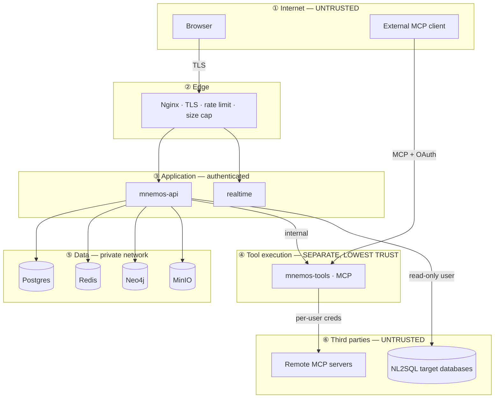

# Threat Model

**Method:** STRIDE per trust boundary, plus an LLM-specific analysis that STRIDE does not
cover. **Scope:** the Mnemos platform, its three flows, and the MCP tool service.

**Read this before writing any retrieval, tool, or SQL code.** Several controls here are
structural — they cannot be retrofitted onto an implementation that assumed otherwise.

---

## 1. Assets

| Asset | Why it matters | Impact if compromised |
|---|---|---|
| Memory claims | Accumulated knowledge about people and organizations | Severe — privacy breach, cross-tenant leak |
| Context bundles | Contain assembled excerpts of everything above | Severe — a single bundle can concentrate an entire dossier |
| Datasource credentials (NL2SQL) | Direct database access | Severe — data exfiltration at source |
| MCP credentials | OAuth tokens to Gmail, Slack, SharePoint, etc. | **Critical** — lateral movement into third-party systems |
| Policy definitions | Determine all access | Critical — silent authorization bypass |
| Audit log | Evidence of what happened | High — undetectable compromise if tamperable |
| Embeddings | Partially invertible to source text | Moderate–high — treat as sensitive as the source |

**Embeddings are not anonymized data.** Inversion attacks can recover substantial
portions of source text from embedding vectors. `memory_embedding` therefore carries the
same ACL columns and the same erasure obligations as the source claim.

## 2. Trust boundaries

**Boundary ④ is the most important design decision in this document.** `mnemos-tools`
runs as a separate service with its own process, network policy, and credential store,
because it is the only component that executes attacker-influenceable code paths against
third-party systems holding real user credentials. Co-locating it with the API would put
a compromised tool adapter in the same address space as the policy engine.

## 3. STRIDE by boundary

### ① → ② Internet to edge

| Threat | Vector | Control |
|---|---|---|
| **S**poofing | Credential stuffing, token replay | Argon2id; 15-min access tokens; refresh rotation with reuse detection; per-IP + per-account throttling |
| **T**ampering | Request modification | TLS 1.2/1.3 only; HSTS; body size caps at Nginx |
| **R**epudiation | "I never made that request" | Audit log with request ID, IP, UA; append-only |
| **I**nfo disclosure | Enumeration of resources | `404` (not `403`) for unauthorized-but-existing resources; uniform error shapes; constant-time credential comparison |
| **D**oS | Request floods, expensive compilations | Nginx rate limit → app token bucket → **per-org compilation concurrency semaphore** |
| **E**levation | JWT forgery, `alg=none`, key confusion | Algorithm allow-list (never read `alg` from the token); explicit `iss`/`aud`/`exp` validation; JWKS cached with pinned key IDs |

**Compilation concurrency is the DoS control that generic rate limiting misses.** One
request asking for a 32k-token budget with graph expansion and abstractive compression
can occupy a CPU for 20 seconds. A limit of "600 requests/minute" does nothing about
that. The semaphore bounds *concurrent expensive work*, not request count.

### ③ Application tier

| Threat | Vector | Control |
|---|---|---|
| **S** | Session fixation, forged internal headers | Session bound to a fingerprint; **internal service headers are never trusted for identity** |
| **T** | Mass assignment | Pydantic `extra="forbid"`; DTOs never map straight onto domain models |
| **R** | Missing attribution | Every mutation writes `audit_log` with actor and rule ID |
| **I** | **Cross-tenant leakage** | Explicit `org_id` filter + Postgres RLS + org-scoped cache keys + org-scoped Cypher patterns |
| **D** | Resource exhaustion | Bounded queues; per-org budgets; statement timeouts; pool limits per workload class |
| **E** | Privilege escalation via role claims | Roles resolved from DB per request, never from token; `role.is_protected` blocks IdP-granted admin |

**Cross-tenant leakage gets four independent controls because it is the failure that
ends the project.** They are independent by design: an application bug is caught by RLS,
an RLS misconfiguration is caught by the explicit filter, a cache key collision is caught
by org prefixing, and Neo4j — which has no RLS in Community Edition — is protected by
centralizing all Cypher construction in one adapter with no raw-query escape hatch.

### ④ Tool execution

| Threat | Vector | Control |
|---|---|---|
| **S** | Tool executes as the wrong user | Per-user credentials in `mcp_credential`; **no shared service identity exists** to fall back to |
| **T** | Malicious tool arguments | Arguments validated against the tool's JSON Schema before dispatch |
| **R** | Untraceable tool actions | Every invocation logged with principal, run, bundle digest, motivating trust tier |
| **I** | Credential exfiltration by a compromised tool | AES-GCM per-org envelope encryption; credentials decrypted per-invocation and never held; egress restricted to registered endpoints |
| **D** | Tool call floods | Per-principal, per-tool rate limits; bounded concurrency |
| **E** | **Forged-header role escalation** | Roles re-derived from the database on every request. Never read from a header, never cached at connection time. |

The forged-header control is stated absolutely because the failure mode is trivially
exploitable and completely silent. Any code path that reads a role from a request header
is a defect regardless of how convenient it is.

### ⑥ Third-party / NL2SQL targets

| Threat | Control |
|---|---|
| SQL injection via generated SQL | Parameterization where possible; **AST validation always**; read-only database user; statement timeout; row cap |
| Data exfiltration via crafted SQL | Fail-closed table allow-list; the model literally cannot reference a table absent from its context |
| Malicious remote MCP server | Registered endpoints only; response size caps; schema validation of tool output; **all tool output enters at trust tier 6** |
| SSRF via datasource/MCP URLs | Deny-list of link-local, loopback, and private ranges; DNS re-resolution guard against rebinding |

## 4. LLM-specific threats

STRIDE was designed for systems where data and instructions are distinguishable. In an
LLM system they are not. This section covers what STRIDE cannot.

### T1 — Indirect prompt injection *(highest risk in the system)*

**Attack:** an adversary plants instructions in a document, a web page, or a tool
response. It is ingested, retrieved into context, and the model follows it — exfiltrating
data or invoking tools with the user's authority.

**Why the usual mitigations fail.** "Instruct the model to ignore instructions in
retrieved content" is a request, not a control. Models comply inconsistently and
adversarial phrasings defeat it reliably. Any design whose only defence is prompt wording
is unmitigated.

**Layered control:**

| Layer | Control | What it stops |
|---|---|---|
| 1 — Ingest | Assign `trust_tier` at source. Documents from external connectors ≥ 4; tool output = 6. Tier is immutable thereafter. | Laundering untrusted content into trusted storage |
| 2 — Assembly | Fence untrusted sections with explicit non-authority framing; strip control chars and delimiter-escape sequences | Naive delimiter-breakout |
| 3 — **Tool boundary** | Re-authorize every proposed tool call against **the minimum trust tier present in the motivating context** | The actual exfiltration step |
| 4 — Egress | Tool arguments scanned for context-derived secrets; outbound destinations restricted to registered endpoints | Data leaving via tool arguments |
| 5 — Audit | `mcp_invocation.motivating_trust_tier` persisted for every call | After-the-fact detection |

**Layer 3 is the control that actually works.** Layers 1, 2, 4 raise cost; layer 3
changes the outcome. Even if the model is fully persuaded by injected instructions, the
tool call it emits is checked against the trust tier of the context that produced it —
and a call motivated by tier-5 content cannot exercise tier-2 permissions. The model's
compliance becomes irrelevant, which is the only acceptable place to put the guarantee.

Explicit acceptance: injection can still cause a *wrong answer* to the user. Preventing
that entirely is not achievable with current techniques. Preventing injected content from
taking *authorized actions* is achievable, and that is where the boundary is drawn.

### T2 — Memory poisoning

**Attack:** an adversary writes false claims that persist and are retrieved indefinitely
("the approved wire account is …").

**Controls:** trust tier recorded on every claim and surfaced in the manifest; claims
below a configured tier cannot be admitted to high-sensitivity sections; conflict
resolution prefers higher-authority sources; supersession is append-only so poisoning is
*visible in lineage* rather than destructive; anomaly detection on write-rate and
contradiction-rate per source.

Because nothing is overwritten, a poisoning attack is fully reconstructable after the
fact — the original claim still exists with its supersession edge. This is a direct
security benefit of the non-destructive memory model, not a coincidence.

### T3 — Context extraction

**Attack:** a user coaxes the model into reproducing system prompts, policy text, or
other users' data present in context.

**Controls:** ACL pushdown means unauthorized content is **never in the bundle**, so it
cannot be extracted regardless of prompting. This is the strongest possible mitigation —
absence. Policy text is treated as non-secret (security must not depend on prompt
confidentiality), and the manifest gives after-the-fact proof of exactly what was
present.

### T4 — Cross-tenant contamination via caches or embeddings

**Attack:** cache key collision or shared embedding space leaks one org's data to
another.

**Controls:** every cache key is org-prefixed; embedding spaces are org-scoped or
explicitly global; ACL columns are denormalized onto the embedding row so the ANN scan
itself is filtered; an integration test asserts zero cross-tenant results with RLS
deliberately disabled, so the application-layer control is proven independently.

### T5 — Resource exhaustion via crafted requests

**Attack:** requests engineered to maximize compute — huge budgets, deep graph traversal,
forced abstractive compression.

**Controls:** hard caps on every budget dimension independent of what is requested;
per-operator deadlines; graph depth cap; the allocator itself rejects plans whose
estimated cost exceeds the org's remaining quota **before execution**. The optimizer is a
security control here, not only a performance feature.

### T6 — Model supply chain

**Attack:** a malicious model on HuggingFace executes code on load (pickle
deserialization in `.bin` checkpoints).

**Controls:** `safetensors` format only, never `.bin`; model repositories and revisions
pinned by commit hash, never floating tags; checksum verification on download; models
loaded in the inference container which has no credential access. This threat is
specific to the free/local stack and would not exist with hosted APIs — it is the cost of
that choice and is accepted knowingly.

## 5. Cryptography

| Purpose | Choice | Rationale |
|---|---|---|
| Passwords | Argon2id (m=64MB, t=3, p=4) | Memory-hard; OWASP current guidance |
| API key secrets | Argon2id | Same |
| Data at rest (credentials, DSNs, tokens) | AES-256-GCM, per-org DEK under a master KEK | Envelope encryption enables per-tenant key rotation and crypto-shredding |
| **Platform access tokens** | **HS256 (HMAC-SHA256)**, key ≥ 32 bytes | See below. One trust domain, one shared secret, no third-party verifier |
| Refresh tokens | 256-bit `secrets.token_urlsafe`, stored as a SHA-256 digest | High entropy, so there is no dictionary for argon2 to slow down — and the digest column has to stay searchable by a unique index |
| Externally-issued tokens (OIDC) | Asymmetric only — RS\*/PS\*/ES\*/EdDSA, from the IdP's JWKS | We are the verifier and never the signer; an HMAC entry in that allow-list would let a token signed with the *public* key verify |
| Digests | SHA-256 | Content addressing |
| Cursors | HMAC-SHA256 signed | Prevents cursor tampering into an unauthorized scan |
| Randomness | `secrets` module | Never `random` for anything security-relevant |

### 5.1 Why platform tokens are HS256 and not EdDSA — settled in M3.4

This table said **EdDSA (Ed25519)** while `core/config.py` shipped **HS256**, and both
stood unreconciled until a token was actually issued. HS256 is the choice, for reasons
that are about deployment rather than about cryptography:

- **There is no third party to verify.** `api`, `worker` and `realtime` are one trust
  domain, deployed together, reading one `MNEMOS_JWT_SECRET`. Asymmetric signing exists so
  a verifier who must not be able to sign can still verify. Every verifier we have is also
  a signer, so the property is bought and not used.
- **A private key needs somewhere to live.** EdDSA turns "one secret in the environment"
  into key generation, distribution, storage and rotation, with a JWKS endpoint to publish
  the public half. There is no KMS and no secret manager in this stack (C1: zero paid
  dependencies), so the private key would end up in the same environment variable the HMAC
  secret is in today — the same exposure, with more moving parts.
- **The security-critical half is identical either way, and it is the allow-list.**
  Neither algorithm defends anything if the verifier reads `alg` out of the token it is
  verifying. `providers/platform.py` passes a fixed one-element `algorithms=` list to the
  decoder and never consults the header, which is what makes `alg: none` and every
  algorithm-substitution forgery fail. That discipline — not the algorithm name — is what
  the tests pin.

**What would change this.** The moment a verifier exists outside the signing trust domain —
a separately-deployed MCP tool service (M11) validating our tokens, an external audit
consumer, or tokens crossing an organisational boundary — HS256 stops being defensible,
because verification would require handing out the ability to mint. At that point switch to
EdDSA: `PlatformTokenConfig` already carries the algorithm as a field and validates it
against an allow-list, so the change is that allow-list, a key pair, and a JWKS route.

Key rotation is designed in from the start: `key_version` columns accompany every
encrypted field, so re-encryption is a background job rather than an outage. Crypto-
shredding a per-org DEK is also the fastest correct answer to a full-tenant erasure
request.

## 6. Secrets

- Never in code, defaults, logs, error responses, or git history.
- `.env.example` holds keys with empty values.
- `SecretStr` in memory; a redacting log processor as a backstop.
- `gitleaks` in pre-commit and CI.
- Local development uses generated per-developer secrets, never shared fixtures — a
  shared dev secret eventually appears in a screenshot.

## 7. PII

| Stage | Control |
|---|---|
| Ingest | Presidio-based detection (free, local); classification tags written onto the claim |
| Storage | Field-level encryption for flagged fields; `sensitivity` column drives ACL predicates |
| Retrieval | Sensitivity participates in the authorization predicate — high-sensitivity content requires explicit grant |
| Logs/traces | Redaction processor on every record and span |
| Erasure | DSR path cascades through claims, embeddings, graph, bundle items, objects — **and re-embeds derived summaries** |

The re-embedding step is easy to omit and is the reason most erasure implementations are
incomplete: a summary generated from erased content still contains it, and its embedding
still encodes it.

## 8. Residual risks — accepted, with reasons

| Risk | Why accepted | Compensating control |
|---|---|---|
| Prompt injection can still produce a wrong *answer* | Not solvable with current techniques | Tool authority contained (T1 L3); provenance lets a user check sources |
| Local model output quality is lower than frontier models | Zero-cost constraint | Validation layers, bounded repair, human gates on high-impact actions |
| Neo4j CE has no RBAC or RLS | Free-stack ceiling | All Cypher centralized in one org-scoping adapter; no raw-query escape hatch |
| Single-node deployment has no HA | Portfolio scope, stated openly | Documented; outbox means no data loss on restart |
| Embeddings are partially invertible | Inherent to the technique | Treated as sensitive: same ACLs, same erasure obligations |
| Audit log is append-only by grant, not cryptographically chained | Complexity not warranted at this scope | No `UPDATE`/`DELETE` grant to the application role; hash chaining noted as a future ADR |

## 9. Security checklist for every PR

- [ ] No new endpoint without an explicit authorization check (deny-by-default)
- [ ] Every new query filters `org_id`; new tables have RLS enabled + `FORCE`
- [ ] No user input concatenated into SQL or Cypher
- [ ] New retrievable content assigned a `trust_tier` at its source
- [ ] New tool declares `min_trust_tier` and `side_effect`
- [ ] No secret in code, defaults, logs, or error responses
- [ ] New cache keys include the org and a version component
- [ ] Errors return no internal detail across the API boundary
- [ ] `bandit` and `pip-audit` clean
